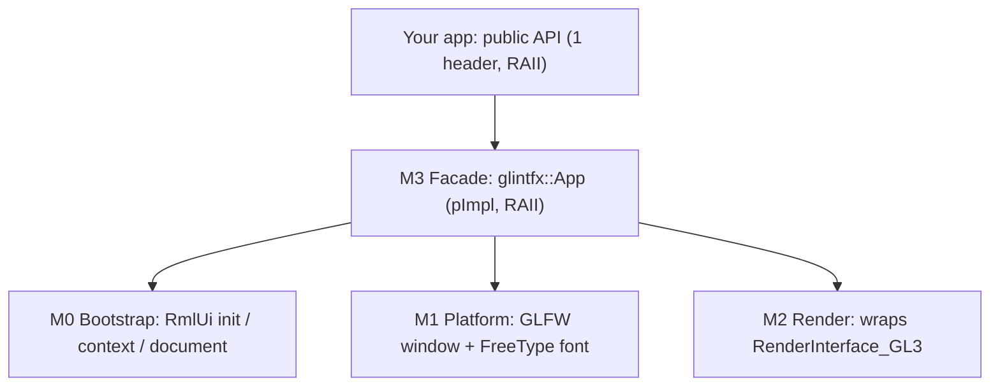
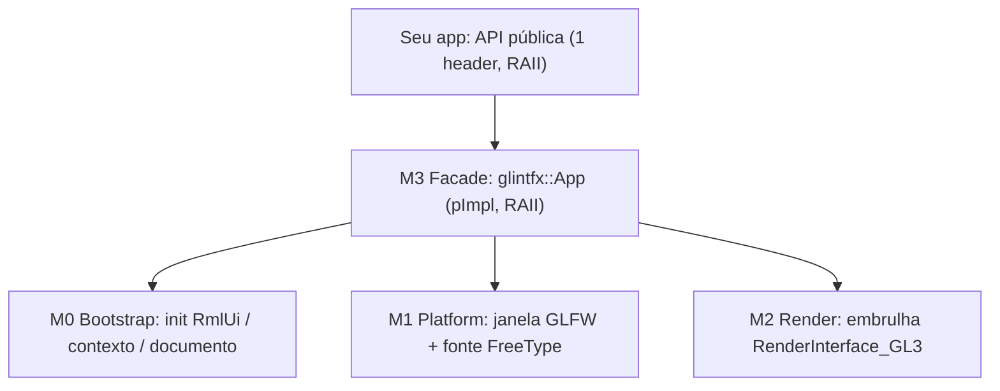

# glintfx

[](LICENSE)
[](#)
[](CLAUDE.md#camada-0----n%C3%BAcleo-soberano-c--asm-puro)
[](CLAUDE.md#camada-0----n%C3%BAcleo-soberano-c--asm-puro)
[](#)
[](#)
[](CHANGELOG.md)
[-yellow.svg)](CHANGELOG.md)
[](docs/embed-integration.md)
[](https://github.com/mikke89/RmlUi)
[](#)
[](https://github.com/petrinhu/glintfx/actions/workflows/ci.yml)
[](https://codeberg.org/petrinhu/glintfx/actions/workflows/ci.yml)
[](https://codeberg.org/petrinhu/glintfx/actions/workflows/ci.yml)

<sub>**EN:** the `C`/`Assembly` badges describe this **repository** as a whole -- it also hosts `loucura_c_asm` ("Layer 0"), a separate, unreleased, zero-libc C+ASM runtime that does **not** link into glintfx (glintfx itself is pure C++; see [ADR-0006](docs/adr/0006-layered-hybrid-architecture.md)). The `API: pre-1.0` badge reflects [Semantic Versioning](https://semver.org/)'s pre-1.0.0 clause: the public API may still change between minor versions.</sub>
<sub>**PT:** os badges `C`/`Assembly` descrevem este **repositório** como um todo -- ele também hospeda o `loucura_c_asm` ("Camada 0"), um runtime C+ASM zero-libc separado e ainda não lançado, que **não** linka no glintfx (o glintfx em si é C++ puro; ver [ADR-0006](docs/adr/0006-layered-hybrid-architecture.md)). O badge `API: pre-1.0` reflete a cláusula pré-1.0.0 do [Versionamento Semântico](https://semver.org/): a API pública ainda pode mudar entre versões minor.</sub>

> **EN:** A drop-in C++ library that fuses an HTML/CSS UI engine ([RmlUi 6.3](https://github.com/mikke89/RmlUi)) with a GL3 effects renderer (glow, gradient, backdrop-blur, drop-shadow, mask). Link one CMake target and write CSS, with no OpenGL/GLFW/RmlUi wiring by hand. Two consumption modes: the standalone `glintfx::App` (owns its window) and `glintfx::UiLayer` (embeds into a host-owned GL context, e.g. a game engine).
>
> **PT:** Uma biblioteca C++ drop-in que funde um motor de UI HTML/CSS ([RmlUi 6.3](https://github.com/mikke89/RmlUi)) com um renderer de efeitos GL3 (glow, degradê, backdrop-blur, drop-shadow, mask). Linke um alvo CMake e escreva CSS, sem wirar OpenGL/GLFW/RmlUi à mão. Dois modos de consumo: o `glintfx::App` standalone (dono da própria janela) e o `glintfx::UiLayer` (embute num contexto GL de um host, ex.: um engine de jogo).

- **Codeberg:** https://codeberg.org/petrinhu/glintfx
- **GitHub:** https://github.com/petrinhu/glintfx

Languages / Idiomas: **[English](#english)** · **[Português](#português)**

---

## English

### What it is

`glintfx` is a **drop-in C++ library for Linux x86-64** that combines two things developers usually have to wire together by hand:

1. **A UI engine:** [RmlUi 6.3](https://github.com/mikke89/RmlUi), which lays out interfaces using **HTML-like markup (`.rml`)** and **CSS-like stylesheets (`.rcss`)**.
2. **A GL3 effects renderer:** applies GPU visual effects (**glow, gradient, backdrop-blur, drop-shadow, mask**) driven entirely from your stylesheet.

### Why it exists

Getting a single effect (say, a glow) onto a UI normally means stitching together RmlUi, a GL3 renderer, an OpenGL loader, and a window/context backend (GLFW): easily half an hour of plumbing before anything appears on screen.

`glintfx` is **batteries-included**: you add **one CMake target**, write your markup and CSS, and the effect shows up. No OpenGL, GLFW, or RmlUi types ever appear in your code; the public header (`<glintfx/glintfx.hpp>`) exposes only the `glintfx::App` facade.

### Features

- **Drop-in integration:** one target (`glintfx::glintfx`) via CMake `FetchContent` or `find_package(glintfx)`; no manual graphics setup.
- **Data-driven effects:** glow, gradient, backdrop-blur, drop-shadow, mask, a regular-polygon fill (`decorator: polygon(sides, fill[, rotation])`, `fill` a solid `color` or a `radial-gradient(...)`/`linear-gradient(...)` -- e.g. a hexagonal badge or gauge fill), and a luminance-key texture tint (`decorator: image-tint(url)` + `image-tint-color`/`-mode`/`-threshold` -- recolors only light+neutral texels of one base texture into N domain colors, preserving saturated/dark detail), all expressed in `.rcss` (no imperative effect API to learn).
- **Two consumption modes:** the standalone `glintfx::App` (owns the window and the frame loop) and `glintfx::UiLayer` (embed/guest mode: attaches to a host-owned GL context, compose-only render, injected events; see [`docs/embed-integration.md`](docs/embed-integration.md)). Both share the same data-model, dp_ratio, and base-URL API.
- **Data-model binding:** `create_data_model` + `bind_number/string/bool/list` + `set_*`, with live lists driven by `data-for` in RML -- scrolling logs, menus, inventories.
- **PNG, JPEG, and TGA textures:** decoded via stb_image with correct premultiplied-alpha handling for the GL3 blend.
- **DPI-aware layout (`dp_ratio`)** and **`set_asset_base_url`** for assets that don't live next to the process's working directory.
- **Click callback (hit-test):** `set_click_callback(std::function<void(const char* id)>)` on both `App` and `UiLayer` reports the id of the clicked element (bubbling up to the nearest ancestor with an id, `""` if none) -- lets a host react to UI clicks without owning RmlUi's event system.
- **Element geometry query:** `get_element_box(const char* id)` returns the border-box geometry (`x, y, w, h`, window-space physical pixels) of any element by id -- useful for a host that needs to align its own overlays with UI elements.
- **Letterbox viewport (`UiLayer` only):** `set_viewport(x, y, w, h, target_h)` composes the UI within a sub-region of the host's window, with a configurable origin (not just `(0, 0)`).
- **Programmatic focus control:** `set_focus(const char* id)`/`clear_focus()` on both `App` and `UiLayer`, for hosts whose model owns selection (e.g. a game menu driven by data-binding rather than RmlUi's own Tab/arrow navigation).
- **DOM read/write by id, and data-model read-back:** `set_text`/`add_class`/`remove_class`/`set_property(id, ...)` on both `App` and `UiLayer` for imperative element mutation (`set_text` treats its argument as literal text -- `&`/`<`/`>`/`"` are always escaped before reaching RmlUi, so it can never be used to inject markup); `get_number`/`get_string`/`get_bool(key, out)` complete the data-model API, letting a host read back a value the UI or the user (via a bound `<input>`) wrote into the model -- previously write-only. See [`docs/embed-integration.md`](docs/embed-integration.md) section 15.
- **Form/DOM event callbacks:** `set_change_callback(id, value)`/`set_submit_callback(id)`/`set_focus_callback(id)`/`set_blur_callback(id)`/`set_hover_callback(id, entered)` on both `App` and `UiLayer` -- forms and focus/hover are no longer inert to the host; these are the hooks a host uses to trigger its own sound/UX reaction (glintfx does not play audio itself). See [`docs/embed-integration.md`](docs/embed-integration.md) section 16.
- **Hardened input surface:** `load(nullptr)` returns `false` instead of crashing the host; `set_dp_ratio` rejects non-finite or non-positive values; `set_viewport` rejects non-positive width/height. All fail-safe (reject and keep previous state), never fail-open.
- **Clean public API:** two RAII facades (`glintfx::App`, `glintfx::UiLayer`); no third-party types leak into your headers.
- **Self-contained build, own clean-room GL loader:** RmlUi fetched automatically; the third-party `gl3w` OpenGL loader is gone, replaced by glintfx's own clean-room GL 3.3 core-profile loader (`glintfx/src/gl_loader.{h,c}`), generated from the public Khronos `gl.xml` registry (works offline); GLFW/FreeType/OpenGL from the system. `GLINTFX_BACKEND_GLFW=OFF` builds an embed-only library with no GLFW dependency at all.
- **Bundled showcase:** a runnable demo exercising all five effects.

### Requirements

| Item | Requirement |
| :--- | :--- |
| OS / Arch | Linux x86-64 |
| Compiler | clang (C++17 floor, C++23 target) |
| Build | CMake >= 3.16 |
| System packages (Fedora) | `glfw-devel`, `freetype-devel`, `mesa-libGL-devel` |
| Runtime | OpenGL 3.3 |

RmlUi 6.3 is fetched at configure time; glintfx's own GL loader (generated from the Khronos `gl.xml` registry) is vendored in the repo.

### Compatibility

| Component | Requirement | Notes |
| :--- | :--- | :--- |
| RmlUi | **6.3**, pinned via CMake `FetchContent` to a fixed upstream commit | Only this exact pinned version is supported/tested. Other RmlUi versions are not supported -- swapping the `GIT_TAG` in `glintfx/CMakeLists.txt` is unsupported and untested. |
| OpenGL | **3.3, core profile** | Required at runtime by the GL3 render layer. |
| Compiler | **clang** (C++17 floor, C++23 target) | `glintfx/CMakeLists.txt` does not pin or enforce a minimum clang version (no `CMAKE_CXX_COMPILER` check). **GCC is not officially declared/documented as supported** -- however, `.github/workflows/ci.yml`'s `lint-and-scan` job installs and builds the library with `g++` on every push/PR (the equivalent job on the Codeberg side, `.forgejo/workflows/ci.yml`, was reduced to minimal parity in Onda 3 and no longer does this -- see that file's header), so GCC builds are exercised in practice on GitHub even though it is not a documented contract. If you rely on GCC, treat it as unverified upstream of this table and report build issues. |
| CMake | **>= 3.16** | Enforced by `cmake_minimum_required` in `glintfx/CMakeLists.txt`. |
| OS / Architecture | **Linux x86-64 only** | No Windows/macOS/ARM support; see [Known limitations](#known-limitations). |

> glintfx is built on [RmlUi](https://github.com/mikke89/RmlUi) (MIT License) -- our thanks to mikke89 and the RmlUi contributors. When we find and fix a genuine bug in RmlUi itself, we track it as an explicit source patch applied automatically at `FetchContent` time (`glintfx/patches/`, see `glintfx/patches/README.md`), and aim to report it back upstream; see [`docs/embed-integration.md`](docs/embed-integration.md) section 18 and [`NOTICE`](NOTICE) for the current example (a document/element teardown UB fix).

### Quick start

**1. Consume `glintfx` via CMake FetchContent.** In your `CMakeLists.txt`:

```cmake
include(FetchContent)
FetchContent_Declare(glintfx
  GIT_REPOSITORY https://codeberg.org/petrinhu/glintfx.git
  GIT_TAG        v0.4.0)
FetchContent_MakeAvailable(glintfx)

add_executable(app main.cpp)
target_link_libraries(app PRIVATE glintfx::glintfx)   # one line, no GL/GLFW/RmlUi
```

> **Alternative: installed tree (`find_package`).** If glintfx has been installed via `cmake --install`, use `find_package` instead of `FetchContent`; `glintfxConfig.cmake` and RmlUi are co-installed under the same prefix:
> ```cmake
> find_package(glintfx REQUIRED)
> add_executable(app main.cpp)
> target_link_libraries(app PRIVATE glintfx::glintfx)
> ```

**2. Write the minimal app** (`main.cpp`):

```cpp
#include <glintfx/glintfx.hpp>

int main() {
    glintfx::App app({ .title = "hello glintfx", .width = 900, .height = 600 });
    app.load("hello.rml");
    app.run();              // poll + update + render until the window closes
    return 0;
}
```

**3. Add the markup** (`hello.rml`):

```html
<rml>
<head>
  <link type="text/rcss" href="hello.rcss"/>
  <title>hello glintfx</title>
</head>
<body>
  <div class="card glow">Glow</div>
</body>
</rml>
```

**4. Add the stylesheet with one effect** (`hello.rcss`):

```css
body { display: block; background-color: #0d1020; color: #fff; }

.card {
    display: block;
    width: 260px; height: 80px;
    margin: 16px; padding: 16px;
    border-radius: 12px;
    font-size: 20px;
}

/* Cyan outer glow. RmlUi order: COLOR x y blur spread. Hex is #rrggbbaa. */
.glow {
    background-color: #1e2a50;
    box-shadow: #5fd0ff 0 0 32px 8px;
}
```

Build and run your project as usual. A window opens showing a card with a cyan glow.

> **Note:** Only **one** `glintfx::App` instance may exist per process (see [Known limitations](#known-limitations)).

### Building the bundled demo

From a clone of this repository:

```sh
# system deps (Fedora)
sudo dnf install glfw-devel freetype-devel mesa-libGL-devel

# configure + build (RmlUi is fetched automatically)
cmake -S glintfx -B glintfx/build
cmake --build glintfx/build

# run the showcase (all five effects)
./glintfx/build/demos/showcase/glintfx_showcase
```

### Testing & coverage

Run the full test suite with `ctest --test-dir glintfx/build`. For a local self-hosted code-coverage report (Clang/llvm-cov, no third-party uploader), run `tools/coverage_report.sh` from the repo root -- it builds an instrumented config, runs the suite, and writes an HTML report to `glintfx/build-cov/coverage-html/index.html`. See [`TESTES.md`](TESTES.md#tst-l1-cov) for the CI gate and floor policy.

**Local pre-push gate.** Run `git config core.hooksPath .githooks` once per clone to activate `tools/preci.sh` (TST-L1-PRECI) as a `git push` gate: it detects which layer(s) you touched and runs just that build+test (fast, day-to-day); `tools/preci.sh --full` additionally runs both glintfx configs plus the encapsulation and secret-scan checks, for occasional manual runs. See [`TESTES.md`](TESTES.md#tst-l1-preci).

### Effects (RCSS syntax)

Effects are **data-driven**: you declare them in `.rcss`. RmlUi 6.3 syntax differs from standard CSS in a few places. Most notably, **color comes first** in shadows, and **gradients use `decorator:`**, not `background:`.

| Effect | RCSS property | Example |
| :--- | :--- | :--- |
| Outer glow / box shadow | `box-shadow: COLOR x y blur spread` | `box-shadow: #5fd0ff 0 0 32px 8px;` |
| Drop shadow (alpha-shaped) | `filter: drop-shadow(COLOR x y blur)` | `filter: drop-shadow(#5fd0ff80 0 0 20px);` |
| Gradient | `decorator: linear-gradient(angle, colors)` | `decorator: linear-gradient(45deg, #ff6a00, #ee0979);` |
| Regular polygon fill | `decorator: polygon(sides, fill[, rotation])`, `fill` = `color` or `radial-/linear-gradient(...)` | `decorator: polygon(6, #5fd0ff);` |
| Backdrop blur | `backdrop-filter: blur(Npx)` | `backdrop-filter: blur(8px);` |
| Blur filter | `filter: blur(Npx)` | `filter: blur(4px);` |
| Mask | `mask-image: horizontal-gradient(COLOR COLOR)` | `mask-image: horizontal-gradient(#000f #0000);` |

Colors are **8-digit hex** `#rrggbbaa` (alpha is the last two digits). See [`docs/effects.md`](docs/effects.md) for the full how-to and the real showcase stylesheet at [`glintfx/demos/showcase/showcase.rcss`](glintfx/demos/showcase/showcase.rcss).

### Architecture

`glintfx` is a thin facade over four internal modules. No graphics or RmlUi type crosses the public boundary.



- **M0 Bootstrap:** RmlUi lifecycle (initialise/shutdown, context, load `.rml` + `.rcss`).
- **M1 Platform:** window/context (GLFW) and font engine (FreeType).
- **M2 Render:** wraps RmlUi's real `RenderInterface_GL3` (the GLSL effects).
- **M3 Facade:** the public `glintfx::App`; hides the triad and runs the loop.

Design detail: [`docs/superpowers/specs/2026-06-28-camada1-rmlui-gl3-design.md`](docs/superpowers/specs/2026-06-28-camada1-rmlui-gl3-design.md). Architecture decisions: [ADR-0006](docs/adr/0006-layered-hybrid-architecture.md) (layers), [ADR-0007](docs/adr/0007-license-mpl-2.0.md) (license).

### Documentation

- **Tutorial:** [`docs/getting-started.md`](docs/getting-started.md), from zero to your first effect.
- **How-to / reference:** [`docs/effects.md`](docs/effects.md), the RCSS effect syntax.
- **Embed integration:** [`docs/embed-integration.md`](docs/embed-integration.md), the contract for hosts that own their window and GL context (`glintfx::UiLayer`).
- **Packaging:** [`docs/packaging.md`](docs/packaging.md), the `cmake --install` + `find_package(glintfx)` flow for consuming a pre-built tree.
- **Troubleshooting:** [`docs/troubleshooting.md`](docs/troubleshooting.md), the most likely integration errors and their fixes.
- **API reference:** the public headers under [`glintfx/include/glintfx/`](glintfx/include/glintfx/) are fully doc-commented (bilingual, EN then PT) -- treat them as the authoritative, always-current API reference; a generated (Doxygen) reference is not yet published.
- **Architecture / rationale:** the [ADRs](docs/adr/README.md) and the [design spec](docs/superpowers/specs/2026-06-28-camada1-rmlui-gl3-design.md).
- **Versioning policy:** [`CONTRIBUTING.md#versioning`](CONTRIBUTING.md#versioning) -- what counts as a minor vs. a patch release while glintfx is pre-1.0.
- **Contributing:** [`CONTRIBUTING.md`](CONTRIBUTING.md). **AI agents:** [`AGENTS.md`](AGENTS.md). **Security:** [`SECURITY.md`](SECURITY.md).

### Known limitations

`glintfx` v0.4.0 is honest about what is not yet there:

- **Linux x86-64 only.** No Windows/macOS.
- **One `App` per process.** GLFW and RmlUi global state make a second instance undefined behaviour.
- **The `mask` effect needs a real GPU.** Under Mesa/llvmpipe (software, e.g. headless CI) the dual-sampler mask shader crashes, a Mesa bug rather than a glintfx bug. The CI variant runs without the mask card.
- **GLFW window backend is optional.** By default (`-DGLINTFX_BACKEND_GLFW=ON`) the standalone `glintfx::App` is compiled and GLFW is linked. With `-DGLINTFX_BACKEND_GLFW=OFF` (embed-only build) only `glintfx::UiLayer` is available and the library does not drag GLFW as a transitive dependency. Designed for SDL3/X11 hosts (e.g. GusWorld) that own the window and GL context themselves. See [ADR-0008](docs/adr/0008-embed-guest-mode.md).
- **SDL and X11 standalone backends are planned but not yet implemented.** The embed path (host provides the GL context) is the integration point for non-GLFW hosts today.
- **CI active (GitHub Actions primary + `claudio` self-hosted Forgejo runner for depth + Codeberg Forgejo Actions for minimal parity).** The full 38-test suite (GLFW=ON) and 22-test embed suite (GLFW=OFF), plus lint/scan and coverage gates, run on every push/PR via `.github/workflows/ci.yml`; the same ASan/LSan/UBSan sanitize gate plus the own-font-engine regression job run on PRs to `main` and on tags via `.forgejo/workflows/heavy.yml` (self-hosted `claudio` runner). `.forgejo/workflows/ci.yml` on `codeberg-medium` runs a single GLFW=ON leg on push to `main` as a voluntary "still builds on Codeberg" signal, not a release gate -- see that file's header for the full `github > claudio > codeberg` gate-authority rationale (Onda 3, 2026-07-11).
- **Two CMake integration paths:** `FetchContent` / `add_subdirectory` (recommended when building from source) and `find_package(glintfx)` for an installed tree via `cmake --install`, linking `glintfx::glintfx`; `glintfxConfig.cmake` and RmlUi are co-installed under the same prefix.

### Roadmap and vision

> **Current release: v0.9.2** (stable, tagged), 2026-07-14. Full history in [`CHANGELOG.md`](CHANGELOG.md). Battle-tested by a real consumer (GusWorld, an SDL3 game) across the releases below.

**Delivered (v0.2.x-v0.9.0):**

- **Embed / guest mode ([ADR-0008](docs/adr/0008-embed-guest-mode.md)), v0.2.0:** the `UiLayer` facade **attaches to a host-owned GL context** (game / engine) instead of creating its own window -- compose-only render, injected events, full GL state save/restore (`GlStateGuard`). Enables using glintfx **inside** a game without owning the window. First consumer: GusWorld / GusEngine (SDL3). The standalone `App` stays intact for UI-only apps. Integration contract: [`docs/embed-integration.md`](docs/embed-integration.md).
- **Optional GLFW backend, v0.2.1:** `GLINTFX_BACKEND_GLFW=OFF` builds an embed-only library (`UiLayer` only) with no GLFW dependency, for SDL3/X11 hosts.
- **`dp_ratio` and `set_asset_base_url`, v0.2.2:** DPI-aware layout scaling and a configurable asset base URL, on both `App` and `UiLayer`.
- **Data-model binding and PNG/JPG textures, v0.2.3:** `create_data_model`/`bind_*`/`set_*` with `data-for` list iteration; texture decoding via stb_image with correct alpha premultiplication.
- **UA stylesheet, v0.2.4:** built-in `display: block` defaults for structural elements, merged into every document as a low-specificity base.
- **Click callback, element geometry, and letterbox viewport, v0.2.5:** `set_click_callback` (hit-test id reporting), `get_element_box` (border-box geometry query), and `UiLayer::set_viewport(x, y, w, h, target_h)` (configurable composition origin) -- together, they let a host react to UI clicks and align its own overlays with glintfx elements without reaching into RmlUi internals. See `docs/embed-integration.md` section 10 for the shared window-space coordinate contract.
- **`polygon()` decorator and API input hardening, v0.3.0:** `decorator: polygon(sides, color[, rotation])`, a solid-color regular-N-gon shape primitive (`sides` clamped to `[3, 1024]`, fail-high on invalid input; glow and clip-path reuse `drop-shadow`/`mask-image` with zero new API) -- a reusable building block for hexagonal, triangular, or octagonal UI accents (badges, gauges, corner decorations) without a custom decorator. Plus hardening of the public API surface: `load(nullptr)` now returns `false` instead of crashing the host, `set_dp_ratio`/`set_viewport` reject non-finite or non-positive values, and `version()` is fixed to report the actual tag (it had been stuck reporting `"0.2.4"` since v0.2.5). See [`docs/effects.md`](docs/effects.md).
- **Gradient polygon fill and two memory-safety fixes, v0.3.1:** `polygon()`'s fill argument now also accepts `radial-gradient(...)`/`linear-gradient(...)` (a real per-pixel color ramp via RmlUi's own gradient shader, not a faceted approximation) -- useful for metallic, glassy, or radially-lit polygon accents that a flat color can't sell. Plus two bugs found via audit: `load()` used to leak the previously loaded document and leave it rendering as a visible "ghost" underneath the new one on every reload; `bind_number`/`bind_string`/`bind_bool`/`bind_list` used to trigger a heap-use-after-free when called twice with the same key before `load()`.
- **Scrolling in embed mode, v0.4.0:** mouse-wheel forwarding (`UiEvent::Type::MouseWheel`, scrolls the HOVERED element's closest scrollable ancestor, same convention as `Rml::Context::ProcessMouseWheel`) plus five programmatic scroll methods on `UiLayer`/`App` -- `scroll_element_into_view`, `get/set_element_scroll_top`, `get_element_scroll_height`, `get_element_client_height` (the full scroll-metrics trio, for custom scrollbar UIs). See [`docs/embed-integration.md`](docs/embed-integration.md). Both are now guarded, fail-safe. See [`CHANGELOG.md`](CHANGELOG.md).
- **Own clean-room GL loader, v0.8.0 (`L1.14-GLLOADER`):** the third-party `gl3w` OpenGL loader is gone, replaced by glintfx's own clean-room GL 3.3 core-profile function-pointer loader (`glintfx/src/gl_loader.{h,c}`, 344 commands), generated by `tools/gen_glloader.py` from the public Khronos `gl.xml` API registry. First milestone of the long-term internalization track. See [`CHANGELOG.md`](CHANGELOG.md).
- **`set_focus(id)`/`clear_focus()` on `UiLayer` and `App`, v0.8.0 (`L1.17-FOCUS`):** programmatic focus control for hosts whose model owns selection (e.g. a game menu driven by data-binding rather than RmlUi's own Tab/arrow navigation) -- closes the `GAP-4` item tracked in `TODO.md`. Gated by the element's RCSS `focus` property (default `auto`, not by `tab-index`/HTML-style tabindex -- see [`docs/embed-integration.md`](docs/embed-integration.md) section 5 for the full contract, confirmed against the pinned RmlUi 6.3 source).
- **DOM read/write by id, and data-model read-back, v0.9.0 (`L1.16-DOMRW`):** `set_text`/`add_class`/`remove_class`/`set_property(id, ...)` on both `App` and `UiLayer` for imperative element mutation (`set_text` escapes `&`/`<`/`>`/`"` before reaching RmlUi, so it can never inject markup); `get_number`/`get_string`/`get_bool(key, out)` complete the data-model API, which was write-only before this. See [`docs/embed-integration.md`](docs/embed-integration.md) section 15.
- **Form/DOM event callbacks, v0.9.0 (`L1.15-FORMEV`):** `set_change_callback(id, value)`/`set_submit_callback(id)`/`set_focus_callback(id)`/`set_blur_callback(id)`/`set_hover_callback(id, entered)` on both `App` and `UiLayer` -- forms and focus/hover are no longer inert to the host; these are the hooks a host uses to trigger its own sound/UX reaction. See [`docs/embed-integration.md`](docs/embed-integration.md) section 16.
- **Self-hosted code coverage in CI, v0.9.0 (`L1.18-COVCI`):** llvm-cov (Clang source-based coverage), no third-party uploader; a 75%-floor gate in `.github/workflows/ci.yml` (GitHub-only since Onda 3, 2026-07-11 -- `.forgejo/workflows/ci.yml` was reduced to minimal parity and no longer runs this job), an HTML report artifact, and the `Coverage` badge above (reads `glintfx/coverage-badge.json`, committed to the repo by the GitHub job, straight off the Codeberg git blob -- no CI needs to run on Codeberg for the badge to work). Local-first script: `tools/coverage_report.sh`.

**Planned (paused, not yet started):**

- **v2 -- game UI component library:** menus, dialogue boxes, windows, font styles, and GPU effect components (Atomic Design, tokens-first), all declared in RCSS. Approved spec: [`docs/superpowers/specs/2026-06-30-glintfx-v2-design.md`](docs/superpowers/specs/2026-06-30-glintfx-v2-design.md) (branch `feat/v2-f2-components`).

**Long-term goal (the "loucura"):** make glintfx **independent of its third-party libraries through clean-room reimplementation**, internalizing **RmlUi, FreeType, and GLFW** (the whole userspace stack) over the course of years. One piece is already done: the GL loader (previously the third-party gl3w) was internalized in L1.14-GLLOADER, generated from the public Khronos `gl.xml` registry. This connects to **Layer 0** (the pure C/ASM runtime, its core implementation now complete and pending audit) as the base for internalization. **Irreducible boundary:** `libGL` + the GPU driver + the kernel DRM stack stay. The GPU driver is not reimplemented; accelerated graphics sovereignty stops at the syscall + driver line.

### About this repository (two layers)

This repository is named **glintfx** (the released library above), but it also hosts a second, experimental track:

- **Layer 1 = glintfx:** the C++ library documented here. **Released and the repository's active product** (tag `v0.9.0`).
- **Layer 0 = `loucura_c_asm`:** a sovereign experimental runtime in **pure C + Assembly, zero libc**, talking to the Linux kernel only through syscalls. **Core implementation complete, pending audit:** a freestanding pipeline (`clang -std=c23 -ffreestanding -nostdlib` + NASM + `ld -nostdlib -static -no-pie -e _start`) with a hand-written `_start`, raw syscall wrappers (System V AMD64 ABI), and typed `exit`/`write`/`read` helpers, proven end to end -> a hand-rolled test harness enabling TDD -> a small core libc (memory, string, int-to-string conversion) -> a mini-printf -> a bump allocator over `mmap`, all zero libc and delivered under TDD plus adversarial review. Items sit at `🔍 Pending verification` awaiting the `TST-*`/`F1`/`AUD-*`/`REL-TAG` waves (`core-v0.1.0`) before `✅`. Still a **long-term track**: internalizing glintfx's remaining dependencies (RmlUi, FreeType, GLFW) remains years away (the GL loader piece, gl3w, was already internalized in L1.14-GLLOADER).

Treat glintfx as the product; Layer 0 is a separate long-term track, now implementation-complete and awaiting audit.

### License

**MPL-2.0** (Mozilla Public License 2.0): weak per-file copyleft plus a patent grant; you can link `glintfx` into proprietary or permissively-licensed apps freely. See [`LICENSE`](LICENSE) and the third-party attributions in [`NOTICE`](NOTICE). Rationale: [ADR-0007](docs/adr/0007-license-mpl-2.0.md).

© 2026 Petrus Silva Costa.

---

## Português

### O que é

`glintfx` é uma **biblioteca C++ drop-in para Linux x86-64** que combina duas coisas que devs normalmente precisam unir à mão:

1. **Um motor de UI:** [RmlUi 6.3](https://github.com/mikke89/RmlUi), que monta interfaces com **markup tipo HTML (`.rml`)** e **folhas de estilo tipo CSS (`.rcss`)**.
2. **Um renderer de efeitos GL3:** aplica efeitos visuais na GPU (**glow, degradê, backdrop-blur, drop-shadow, mask**) acionados inteiramente pela sua folha de estilo.

### Por que existe

Colocar um único efeito (digamos, um glow) numa UI normalmente significa costurar RmlUi, um renderer GL3, um loader de OpenGL e um backend de janela/contexto (GLFW): facilmente meia hora de encanamento antes de algo aparecer na tela.

`glintfx` é **batteries-included**: você adiciona **um alvo CMake**, escreve seu markup e CSS, e o efeito aparece. Nenhum tipo de OpenGL, GLFW ou RmlUi aparece no seu código; o header público (`<glintfx/glintfx.hpp>`) expõe só a fachada `glintfx::App`.

### Features

- **Integração drop-in:** um alvo (`glintfx::glintfx`) via CMake `FetchContent` ou `find_package(glintfx)`; sem setup gráfico manual.
- **Efeitos data-driven:** glow, degradê, backdrop-blur, drop-shadow, mask, um preenchimento de polígono regular (`decorator: polygon(lados, preenchimento[, rotação])`, `preenchimento` uma `cor` sólida ou um `radial-gradient(...)`/`linear-gradient(...)` -- ex.: um selo hexagonal ou preenchimento de medidor), e um tingimento de textura por luminance-key (`decorator: image-tint(url)` + `image-tint-color`/`-mode`/`-threshold` -- recolore só texels claros+neutros de uma textura base em N cores de domínio, preservando detalhe saturado/escuro), todos expressos em `.rcss` (sem API imperativa de efeito para aprender).
- **Dois modos de consumo:** o `glintfx::App` standalone (dono da janela e do loop de frame) e o `glintfx::UiLayer` (embed/guest mode: anexa ao contexto GL de um host, render compose-only, eventos injetados; ver [`docs/embed-integration.md`](docs/embed-integration.md)). Os dois compartilham a mesma API de data-model, dp_ratio e base-URL.
- **Ligação de data-model:** `create_data_model` + `bind_number/string/bool/list` + `set_*`, com listas vivas dirigidas por `data-for` no RML -- logs rolantes, menus, inventários.
- **Texturas PNG, JPEG e TGA:** decodificadas via stb_image com tratamento correto de alpha premultiplicado para o blend GL3.
- **Layout sensível a DPI (`dp_ratio`)** e **`set_asset_base_url`** para assets que não ficam ao lado do diretório de trabalho do processo.
- **Callback de clique (hit-test):** `set_click_callback(std::function<void(const char* id)>)` em `App` e `UiLayer` reporta o id do elemento clicado (sobe até o ancestral mais próximo com id, `""` se nenhum) -- permite a um host reagir a cliques na UI sem ser dono do sistema de eventos do RmlUi.
- **Consulta de geometria de elemento:** `get_element_box(const char* id)` retorna a geometria border-box (`x, y, w, h`, pixels físicos espaço-janela) de qualquer elemento por id -- útil para um host alinhar seus próprios overlays com elementos da UI.
- **Viewport letterbox (só em `UiLayer`):** `set_viewport(x, y, w, h, target_h)` compõe a UI numa sub-região da janela do host, com origem configurável (não só `(0, 0)`).
- **Controle de foco programático:** `set_focus(const char* id)`/`clear_focus()` em `App` e `UiLayer`, para hosts cujo modelo é dono da seleção (ex.: um menu de jogo dirigido por data-binding em vez da navegação Tab/setas própria do RmlUi).
- **Leitura/escrita de DOM por id, e leitura de volta do data-model:** `set_text`/`add_class`/`remove_class`/`set_property(id, ...)` em `App` e `UiLayer` para mutação imperativa de elemento (`set_text` trata o argumento como texto literal -- `&`/`<`/`>`/`"` são sempre escapados antes de chegar no RmlUi, então nunca pode ser usado pra injetar markup); `get_number`/`get_string`/`get_bool(key, out)` completam a API de data-model, deixando um host ler de volta um valor que a UI ou o usuário (via um `<input>` ligado) escreveu no modelo -- antes write-only. Ver [`docs/embed-integration.md`](docs/embed-integration.md) seção 15.
- **Callbacks de evento de formulário/DOM:** `set_change_callback(id, value)`/`set_submit_callback(id)`/`set_focus_callback(id)`/`set_blur_callback(id)`/`set_hover_callback(id, entered)` em `App` e `UiLayer` -- formulários e focus/hover deixam de ser inertes pro host; são os ganchos que um host usa pra disparar sua própria reação sonora/UX (a glintfx não toca áudio). Ver [`docs/embed-integration.md`](docs/embed-integration.md) seção 16.
- **Superfície de entrada hardened:** `load(nullptr)` retorna `false` em vez de derrubar o host; `set_dp_ratio` rejeita valores não-finitos ou não-positivos; `set_viewport` rejeita largura/altura não-positivas. Todos fail-safe (rejeita e mantém o estado anterior), nunca fail-open.
- **API pública limpa:** duas fachadas RAII (`glintfx::App`, `glintfx::UiLayer`); nenhum tipo de terceiro vaza para seus headers.
- **Build autocontido, loader GL próprio clean-room:** RmlUi baixado automaticamente; o loader OpenGL de terceiro `gl3w` saiu, substituído pelo loader próprio clean-room GL 3.3 core-profile do glintfx (`glintfx/src/gl_loader.{h,c}`), gerado a partir do registro público Khronos `gl.xml` (funciona offline); GLFW/FreeType/OpenGL do sistema. `GLINTFX_BACKEND_GLFW=OFF` builda uma lib embed-only sem nenhuma dependência de GLFW.
- **Showcase embutido:** um demo executável exercitando os cinco efeitos.

### Requisitos

| Item | Requisito |
| :--- | :--- |
| SO / Arq | Linux x86-64 |
| Compilador | clang (piso C++17, alvo C++23) |
| Build | CMake >= 3.16 |
| Pacotes de sistema (Fedora) | `glfw-devel`, `freetype-devel`, `mesa-libGL-devel` |
| Runtime | OpenGL 3.3 |

RmlUi 6.3 é baixado em tempo de configure; o loader GL próprio do glintfx (gerado a partir do registro Khronos `gl.xml`) é vendorizado no repo.

### Compatibilidade

| Componente | Requisito | Notas |
| :--- | :--- | :--- |
| RmlUi | **6.3**, pinado via `FetchContent` do CMake a um commit fixo do upstream | Só essa versão exata pinada é suportada/testada. Outras versões do RmlUi não são suportadas -- trocar o `GIT_TAG` em `glintfx/CMakeLists.txt` não é suportado nem testado. |
| OpenGL | **3.3, core profile** | Exigido em runtime pelo render layer GL3. |
| Compilador | **clang** (piso C++17, alvo C++23) | O `glintfx/CMakeLists.txt` não pina nem exige uma versão mínima de clang (sem checagem de `CMAKE_CXX_COMPILER`). **GCC não é declarado/documentado oficialmente como suportado** -- porém, o job `lint-and-scan` de `.github/workflows/ci.yml` instala e builda a biblioteca com `g++` em todo push/PR (o job equivalente do lado Codeberg, `.forgejo/workflows/ci.yml`, foi encolhido a paridade mínima na Onda 3 e não faz mais isso -- ver o cabeçalho daquele arquivo), então builds com GCC são exercitados na prática no GitHub mesmo sem ser um contrato documentado. Se você depender de GCC, trate como não-verificado a montante desta tabela e reporte problemas de build. |
| CMake | **>= 3.16** | Exigido por `cmake_minimum_required` em `glintfx/CMakeLists.txt`. |
| SO / Arquitetura | **Somente Linux x86-64** | Sem suporte a Windows/macOS/ARM; ver [Limitações conhecidas](#limitações-conhecidas). |

> O glintfx é construído sobre o [RmlUi](https://github.com/mikke89/RmlUi) (licença MIT) -- nosso agradecimento ao mikke89 e aos contribuidores do RmlUi. Quando encontramos e corrigimos um bug genuíno no próprio RmlUi, rastreamos como um patch de fonte explícito aplicado automaticamente em tempo de `FetchContent` (`glintfx/patches/`, ver `glintfx/patches/README.md`), e buscamos reportá-lo de volta ao upstream; ver [`docs/embed-integration.md`](docs/embed-integration.md) seção 18 e [`NOTICE`](NOTICE) pro exemplo atual (uma correção de UB de teardown de documento/elemento).

### Quick start

**1. Consuma o `glintfx` via CMake FetchContent.** No seu `CMakeLists.txt`:

```cmake
include(FetchContent)
FetchContent_Declare(glintfx
  GIT_REPOSITORY https://codeberg.org/petrinhu/glintfx.git
  GIT_TAG        v0.4.0)
FetchContent_MakeAvailable(glintfx)

add_executable(app main.cpp)
target_link_libraries(app PRIVATE glintfx::glintfx)   # uma linha, sem GL/GLFW/RmlUi
```

> **Alternativa: árvore instalada (`find_package`).** Se o glintfx foi instalado via `cmake --install`, use `find_package` em vez de `FetchContent`; `glintfxConfig.cmake` e o RmlUi são co-instalados sob o mesmo prefixo:
> ```cmake
> find_package(glintfx REQUIRED)
> add_executable(app main.cpp)
> target_link_libraries(app PRIVATE glintfx::glintfx)
> ```

**2. Escreva o app mínimo** (`main.cpp`):

```cpp
#include <glintfx/glintfx.hpp>

int main() {
    glintfx::App app({ .title = "hello glintfx", .width = 900, .height = 600 });
    app.load("hello.rml");
    app.run();              // poll + update + render até a janela fechar
    return 0;
}
```

**3. Adicione o markup** (`hello.rml`):

```html
<rml>
<head>
  <link type="text/rcss" href="hello.rcss"/>
  <title>hello glintfx</title>
</head>
<body>
  <div class="card glow">Glow</div>
</body>
</rml>
```

**4. Adicione a folha de estilo com um efeito** (`hello.rcss`):

```css
body { display: block; background-color: #0d1020; color: #fff; }

.card {
    display: block;
    width: 260px; height: 80px;
    margin: 16px; padding: 16px;
    border-radius: 12px;
    font-size: 20px;
}

/* Glow ciano externo. Ordem do RmlUi: COR x y blur spread. Hex é #rrggbbaa. */
.glow {
    background-color: #1e2a50;
    box-shadow: #5fd0ff 0 0 32px 8px;
}
```

Builde e rode seu projeto normalmente. Uma janela abre mostrando um card com glow ciano.

> **Nota:** Apenas **uma** instância de `glintfx::App` pode existir por processo (ver [Limitações conhecidas](#limitações-conhecidas)).

### Buildar o demo embutido

A partir de um clone deste repositório:

```sh
# deps de sistema (Fedora)
sudo dnf install glfw-devel freetype-devel mesa-libGL-devel

# configure + build (RmlUi é baixado automaticamente)
cmake -S glintfx -B glintfx/build
cmake --build glintfx/build

# rodar o showcase (os cinco efeitos)
./glintfx/build/demos/showcase/glintfx_showcase
```

### Testes & cobertura

Rode a suíte completa com `ctest --test-dir glintfx/build`. Para um relatório local de cobertura de código self-hosted (Clang/llvm-cov, sem uploader de terceiro), rode `tools/coverage_report.sh` a partir da raiz do repo -- ele builda uma config instrumentada, roda a suíte, e escreve um relatório HTML em `glintfx/build-cov/coverage-html/index.html`. Ver [`TESTES.md`](TESTES.md#tst-l1-cov) para o gate de CI e a política de piso.

**Gate local pré-push.** Rode `git config core.hooksPath .githooks` uma vez por clone para ativar `tools/preci.sh` (TST-L1-PRECI) como gate do `git push`: ele detecta qual(is) camada(s) você tocou e roda só aquele build+teste (rápido, dia a dia); `tools/preci.sh --full` roda adicionalmente as duas configs do glintfx mais os checks de encapsulamento e secret-scan, para rodadas manuais ocasionais. Ver [`TESTES.md`](TESTES.md#tst-l1-preci).

### Efeitos (sintaxe RCSS)

Os efeitos são **data-driven**: você os declara no `.rcss`. A sintaxe do RmlUi 6.3 difere do CSS padrão em alguns pontos. Em especial, **a cor vem primeiro** nas sombras, e **gradientes usam `decorator:`**, não `background:`.

| Efeito | Propriedade RCSS | Exemplo |
| :--- | :--- | :--- |
| Glow externo / box shadow | `box-shadow: COR x y blur spread` | `box-shadow: #5fd0ff 0 0 32px 8px;` |
| Drop shadow (segue o alpha) | `filter: drop-shadow(COR x y blur)` | `filter: drop-shadow(#5fd0ff80 0 0 20px);` |
| Degradê | `decorator: linear-gradient(ângulo, cores)` | `decorator: linear-gradient(45deg, #ff6a00, #ee0979);` |
| Preenchimento de polígono regular | `decorator: polygon(lados, preenchimento[, rotação])`, `preenchimento` = `cor` ou `radial-/linear-gradient(...)` | `decorator: polygon(6, #5fd0ff);` |
| Backdrop blur | `backdrop-filter: blur(Npx)` | `backdrop-filter: blur(8px);` |
| Filtro blur | `filter: blur(Npx)` | `filter: blur(4px);` |
| Mask | `mask-image: horizontal-gradient(COR COR)` | `mask-image: horizontal-gradient(#000f #0000);` |

As cores são **hex de 8 dígitos** `#rrggbbaa` (o alpha são os dois últimos dígitos). Ver [`docs/effects.md`](docs/effects.md) para o how-to completo e a folha de estilo real do showcase em [`glintfx/demos/showcase/showcase.rcss`](glintfx/demos/showcase/showcase.rcss).

### Arquitetura

`glintfx` é uma fachada fina sobre quatro módulos internos. Nenhum tipo gráfico ou do RmlUi cruza a fronteira pública.



- **M0 Bootstrap:** ciclo de vida do RmlUi (init/shutdown, contexto, carga de `.rml` + `.rcss`).
- **M1 Platform:** janela/contexto (GLFW) e motor de fonte (FreeType).
- **M2 Render:** embrulha o `RenderInterface_GL3` real do RmlUi (os efeitos GLSL).
- **M3 Facade:** o `glintfx::App` público; esconde a tríade e roda o loop.

Detalhe de design: [`docs/superpowers/specs/2026-06-28-camada1-rmlui-gl3-design.md`](docs/superpowers/specs/2026-06-28-camada1-rmlui-gl3-design.md). Decisões de arquitetura: [ADR-0006](docs/adr/0006-layered-hybrid-architecture.md) (camadas), [ADR-0007](docs/adr/0007-license-mpl-2.0.md) (licença).

### Documentação

- **Tutorial:** [`docs/getting-started.md`](docs/getting-started.md), do zero ao primeiro efeito.
- **How-to / reference:** [`docs/effects.md`](docs/effects.md), a sintaxe RCSS dos efeitos.
- **Integração embed:** [`docs/embed-integration.md`](docs/embed-integration.md), o contrato para hosts donos da própria janela e contexto GL (`glintfx::UiLayer`).
- **Packaging:** [`docs/packaging.md`](docs/packaging.md), o fluxo `cmake --install` + `find_package(glintfx)` para consumir uma árvore pré-buildada.
- **Troubleshooting:** [`docs/troubleshooting.md`](docs/troubleshooting.md), os erros de integração mais prováveis e suas correções.
- **API reference:** os headers públicos em [`glintfx/include/glintfx/`](glintfx/include/glintfx/) são totalmente doc-commented (bilíngue, EN depois PT) -- trate-os como a referência de API autoritativa e sempre atual; uma referência gerada (Doxygen) ainda não está publicada.
- **Arquitetura / racional:** os [ADRs](docs/adr/README.md) e a [spec de design](docs/superpowers/specs/2026-06-28-camada1-rmlui-gl3-design.md).
- **Política de versionamento:** [`CONTRIBUTING.md#versionamento`](CONTRIBUTING.md#versionamento) -- o que conta como release minor vs. patch enquanto o glintfx está pré-1.0.
- **Contribuir:** [`CONTRIBUTING.md`](CONTRIBUTING.md). **Agentes de IA:** [`AGENTS.md`](AGENTS.md). **Segurança:** [`SECURITY.md`](SECURITY.md).

### Limitações conhecidas

A v0.4.0 do `glintfx` é honesta sobre o que ainda não existe:

- **Apenas Linux x86-64.** Sem Windows/macOS.
- **Um `App` por processo.** O estado global de GLFW e RmlUi torna uma segunda instância comportamento indefinido.
- **O efeito `mask` exige GPU real.** Sob Mesa/llvmpipe (software, ex.: CI headless) o shader de mask dual-sampler crasha, bug do Mesa e não do glintfx. A variante de CI roda sem o card mask.
- **Backend de janela GLFW é opcional.** Por padrão (`-DGLINTFX_BACKEND_GLFW=ON`) o `glintfx::App` standalone é compilado e o GLFW é linkado. Com `-DGLINTFX_BACKEND_GLFW=OFF` (build embed-only) só o `glintfx::UiLayer` está disponível e a biblioteca não arrasta GLFW como dep transitiva. Projetado para hosts SDL3/X11 (ex.: GusWorld) que possuem a janela e o contexto GL por conta própria. Ver [ADR-0008](docs/adr/0008-embed-guest-mode.md).
- **Backends standalone SDL e X11 estão planejados mas não implementados.** O caminho embed (host fornece o contexto GL) é o ponto de integração para hosts não-GLFW hoje.
- **CI ativo (GitHub Actions primário + runner self-hosted `claudio` do Forgejo para profundidade + Codeberg Forgejo Actions para paridade mínima).** A suíte completa de 38 testes (GLFW=ON) e a suíte embed de 22 testes (GLFW=OFF), mais os gates de lint/scan e cobertura, rodam em todo push/PR via `.github/workflows/ci.yml`; o mesmo gate ASan/LSan/UBSan mais o job de regressão do motor de fonte próprio rodam em PRs para `main` e em tags via `.forgejo/workflows/heavy.yml` (runner self-hosted `claudio`). O `.forgejo/workflows/ci.yml` no `codeberg-medium` roda uma única perna GLFW=ON em push para `main` como sinal voluntário de "ainda builda no Codeberg", não gate de release -- ver o cabeçalho daquele arquivo para o racional completo de autoridade de gate `github > claudio > codeberg` (Onda 3, 2026-07-11).
- **Dois caminhos de integração CMake:** `FetchContent` / `add_subdirectory` (recomendado ao buildar do fonte) e `find_package(glintfx)` para uma árvore instalada via `cmake --install`, linkando `glintfx::glintfx`; `glintfxConfig.cmake` e o RmlUi são co-instalados sob o mesmo prefixo.

### Roadmap e visão

> **Lançamento atual: v0.9.2** (estável, taggeada), 2026-07-14. Histórico completo em [`CHANGELOG.md`](CHANGELOG.md). Testada na prática por um consumidor real (GusWorld, um jogo SDL3) ao longo das versões abaixo.

**Entregue (v0.2.x-v0.9.0):**

- **Embed / guest mode ([ADR-0008](docs/adr/0008-embed-guest-mode.md)), v0.2.0:** a fachada `UiLayer` **anexa ao contexto GL de um host** (jogo / engine) em vez de criar a própria janela -- render compose-only, eventos injetados, save/restore completo do estado GL (`GlStateGuard`). Permite usar o glintfx **dentro** de um jogo sem ser dono da janela. Primeiro consumidor: GusWorld / GusEngine (SDL3). O `App` standalone permanece intacto para apps só-de-UI. Contrato de integração: [`docs/embed-integration.md`](docs/embed-integration.md).
- **Backend GLFW opcional, v0.2.1:** `GLINTFX_BACKEND_GLFW=OFF` builda uma lib embed-only (só `UiLayer`) sem dependência de GLFW, para hosts SDL3/X11.
- **`dp_ratio` e `set_asset_base_url`, v0.2.2:** escala de layout sensível a DPI e base URL de asset configurável, em `App` e `UiLayer`.
- **Ligação de data-model e texturas PNG/JPG, v0.2.3:** `create_data_model`/`bind_*`/`set_*` com iteração de lista via `data-for`; decodificação de textura via stb_image com premultiplicação correta de alpha.
- **Stylesheet UA, v0.2.4:** defaults embutidos de `display: block` para elementos estruturais, mesclados em todo documento como base de baixa especificidade.
- **Callback de clique, geometria de elemento e viewport letterbox, v0.2.5:** `set_click_callback` (reporte de id via hit-test), `get_element_box` (consulta de geometria border-box) e `UiLayer::set_viewport(x, y, w, h, target_h)` (origem de composição configurável) -- juntos, permitem a um host reagir a cliques na UI e alinhar seus próprios overlays com elementos do glintfx sem entrar nos internals do RmlUi. Ver `docs/embed-integration.md` seção 10 para o contrato de coordenadas espaço-janela compartilhado.
- **Decorator `polygon()` e hardening de entrada da API, v0.3.0:** `decorator: polygon(lados, cor[, rotação])`, uma shape primitive de N-ágono regular de cor sólida (`lados` limitado a `[3, 1024]`, fail-high em input inválido; glow e clip-path reusam `drop-shadow`/`mask-image` sem API nova) -- um bloco reutilizável para acentos de UI hexagonais, triangulares ou octogonais (selos, medidores, decorações de canto) sem precisar de um decorator customizado. Mais hardening da superfície pública: `load(nullptr)` agora retorna `false` em vez de derrubar o host, `set_dp_ratio`/`set_viewport` rejeitam valores não-finitos ou não-positivos, e `version()` foi corrigido para reportar a tag real (estava travado em `"0.2.4"` desde a v0.2.5). Ver [`docs/effects.md`](docs/effects.md).
- **Preenchimento em gradiente no polygon() e dois fixes de segurança de memória, v0.3.1:** o argumento de preenchimento do `polygon()` agora também aceita `radial-gradient(...)`/`linear-gradient(...)` (rampa de cor real por-pixel via o próprio shader de gradiente do RmlUi, não uma aproximação facetada) -- útil para acentos de polígono metálicos, vítreos ou com luz radial, que uma cor lisa não entrega. Mais dois bugs achados via auditoria: `load()` vazava o documento carregado anteriormente e o deixava renderizando como um "fantasma" visível por baixo do novo a cada reload; `bind_number`/`bind_string`/`bind_bool`/`bind_list` disparava um heap-use-after-free quando chamado duas vezes com a mesma chave antes do `load()`. Ambos agora têm guard, fail-safe. Ver [`CHANGELOG.md`](CHANGELOG.md).
- **Rolagem em embed mode, v0.4.0:** encaminhamento de roda do mouse (`UiEvent::Type::MouseWheel`, rola o ancestral rolável mais próximo do elemento em HOVER, mesma convenção do `Rml::Context::ProcessMouseWheel`) mais cinco métodos de scroll programático em `UiLayer`/`App` -- `scroll_element_into_view`, `get/set_element_scroll_top`, `get_element_scroll_height`, `get_element_client_height` (o trio completo de métricas de rolagem, para UIs de scrollbar customizadas). Ver [`docs/embed-integration.md`](docs/embed-integration.md).
- **Loader GL próprio clean-room, v0.8.0 (`L1.14-GLLOADER`):** o loader OpenGL de terceiro `gl3w` saiu, substituído pelo loader próprio clean-room de ponteiros de função GL 3.3 core profile do glintfx (`glintfx/src/gl_loader.{h,c}`, 344 comandos), gerado pelo `tools/gen_glloader.py` a partir do registro público de API `gl.xml` da Khronos. 1º marco da trilha de internalização de longo prazo. Ver [`CHANGELOG.md`](CHANGELOG.md).
- **`set_focus(id)`/`clear_focus()` em `UiLayer` e `App`, v0.8.0 (`L1.17-FOCUS`):** controle de foco programático para hosts cujo modelo é dono da seleção (ex.: um menu de jogo dirigido por data-binding em vez da navegação Tab/setas própria do RmlUi) -- fecha o item `GAP-4` rastreado no `TODO.md`. Controlado pela propriedade RCSS `focus` do elemento (default `auto`, não por `tab-index`/tabindex estilo HTML -- ver [`docs/embed-integration.md`](docs/embed-integration.md) seção 5 para o contrato completo, confirmado contra o source pinado do RmlUi 6.3).
- **Leitura/escrita de DOM por id e read-back do data-model, v0.9.0 (`L1.16-DOMRW`):** `set_text`/`add_class`/`remove_class`/`set_property(id, ...)` em `App` e `UiLayer` para mutação imperativa de elemento (`set_text` escapa `&`/`<`/`>`/`"` antes de chegar no RmlUi, então nunca injeta markup); `get_number`/`get_string`/`get_bool(key, out)` completam a API de data-model, que era write-only antes disto. Ver [`docs/embed-integration.md`](docs/embed-integration.md) seção 15.
- **Callbacks de evento form/DOM, v0.9.0 (`L1.15-FORMEV`):** `set_change_callback(id, value)`/`set_submit_callback(id)`/`set_focus_callback(id)`/`set_blur_callback(id)`/`set_hover_callback(id, entered)` em `App` e `UiLayer` -- formulários e focus/hover deixam de ser inertes pro host; são os ganchos que um host usa pra disparar sua própria reação sonora/UX. Ver [`docs/embed-integration.md`](docs/embed-integration.md) seção 16.
- **Cobertura de código self-hosted no CI, v0.9.0 (`L1.18-COVCI`):** llvm-cov (cobertura source-based do Clang), sem uploader de terceiro; gate de piso 75% em `.github/workflows/ci.yml` (GitHub-only desde a Onda 3, 2026-07-11 -- `.forgejo/workflows/ci.yml` foi encolhido a paridade mínima e não roda mais este job), artifact de relatório HTML, e o badge `Coverage` acima (lê `glintfx/coverage-badge.json`, commitado no repo pelo job do GitHub, direto do blob git do Codeberg -- nenhum CI precisa rodar no Codeberg para o badge funcionar). Script local-first: `tools/coverage_report.sh`.

**Planejado (pausado, ainda não iniciado):**

- **v2 -- component library de UI de jogo:** menus, caixas de diálogo, janelas, estilos de fonte e componentes de efeito GPU (Atomic Design, tokens-first), todos declarados em RCSS. Spec aprovada: [`docs/superpowers/specs/2026-06-30-glintfx-v2-design.md`](docs/superpowers/specs/2026-06-30-glintfx-v2-design.md) (branch `feat/v2-f2-components`).

**Meta de longo prazo (a "loucura"):** tornar o glintfx **independente das suas bibliotecas de terceiros via reimplementação clean-room**, internalizando **RmlUi, FreeType e GLFW** (toda a stack userspace) ao longo de anos. Uma peça já está pronta: o loader GL (antes o gl3w de terceiro) foi internalizado no L1.14-GLLOADER, gerado a partir do registro público Khronos `gl.xml`. Isso se conecta à **Camada 0** (o runtime C/ASM puro, com a implementação do núcleo hoje completa e aguardando auditoria) como base de internalização. **Fronteira irredutível:** `libGL` + o driver de GPU + a stack DRM do kernel permanecem. O driver de GPU não é reimplementado; a soberania de gráfico acelerado para na linha do syscall + driver.

### Sobre este repositório (duas camadas)

Este repositório se chama **glintfx** (a biblioteca lançada acima), mas também abriga uma segunda trilha experimental:

- **Camada 1 = glintfx:** a biblioteca C++ documentada aqui. **Lançada e é o produto ativo deste repositório** (tag `v0.9.0`).
- **Camada 0 = `loucura_c_asm`:** um runtime soberano experimental em **C + Assembly puros, zero libc**, falando com o kernel Linux só por syscalls. **Implementação do núcleo completa, aguardando auditoria:** um pipeline freestanding (`clang -std=c23 -ffreestanding -nostdlib` + NASM + `ld -nostdlib -static -no-pie -e _start`) com `_start` próprio, wrappers de syscall crus (ABI System V AMD64) e helpers tipados `exit`/`write`/`read`, provado ponta a ponta -> um harness de teste próprio habilitando TDD -> uma libc-núcleo pequena (memória, string, conversão int↔string) -> um mini-printf -> um alocador bump via `mmap`, tudo zero libc e entregue sob TDD mais review adversarial. Itens em `🔍 Pendente verificação`, aguardando as ondas `TST-*`/`F1`/`AUD-*`/`REL-TAG` (`core-v0.1.0`) pro `✅`. Ainda é uma trilha **de longo prazo**: internalizar as dependências restantes do glintfx (RmlUi, FreeType, GLFW) segue a anos de distância (a peça do loader GL, gl3w, já foi internalizada no L1.14-GLLOADER).

Trate o glintfx como o produto; a Camada 0 é uma trilha de longo prazo separada, agora com a implementação completa e aguardando auditoria.

### Licença

**MPL-2.0** (Mozilla Public License 2.0): copyleft fraco por-arquivo mais grant de patente; você pode linkar o `glintfx` em apps proprietários ou de licença permissiva livremente. Ver [`LICENSE`](LICENSE) e as atribuições de terceiros em [`NOTICE`](NOTICE). Racional: [ADR-0007](docs/adr/0007-license-mpl-2.0.md).

© 2026 Petrus Silva Costa.
