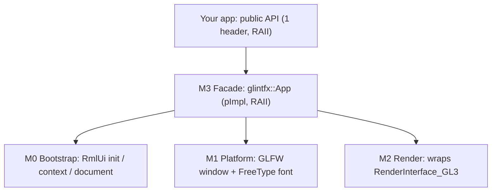
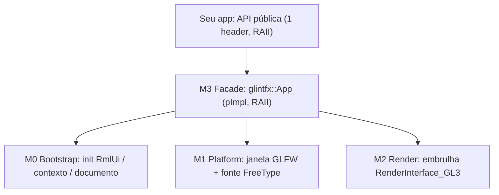

# glintfx

[](LICENSE)
[](#)
[](#)
[](#)
[](CHANGELOG.md)
[](https://github.com/mikke89/RmlUi)
[](#)
[](https://github.com/petrinhu/glintfx/actions/workflows/ci.yml)
[](https://codeberg.org/petrinhu/glintfx/actions/workflows/ci.yml)

> **EN:** A drop-in C++ library that fuses an HTML/CSS UI engine ([RmlUi 6.3](https://github.com/mikke89/RmlUi)) with a GL3 effects renderer (glow, gradient, backdrop-blur, drop-shadow, mask). Link one CMake target and write CSS, with no OpenGL/GLFW/RmlUi wiring by hand. Two consumption modes: the standalone `glintfx::App` (owns its window) and `glintfx::UiLayer` (embeds into a host-owned GL context, e.g. a game engine).
>
> **PT:** Uma biblioteca C++ drop-in que funde um motor de UI HTML/CSS ([RmlUi 6.3](https://github.com/mikke89/RmlUi)) com um renderer de efeitos GL3 (glow, degradê, backdrop-blur, drop-shadow, mask). Linke um alvo CMake e escreva CSS, sem wirar OpenGL/GLFW/RmlUi à mão. Dois modos de consumo: o `glintfx::App` standalone (dono da própria janela) e o `glintfx::UiLayer` (embute num contexto GL de um host, ex.: um engine de jogo).

- **Codeberg:** https://codeberg.org/petrinhu/glintfx
- **GitHub:** https://github.com/petrinhu/glintfx

Languages / Idiomas: **[English](#english)** · **[Português](#português)**

---

## English

### What it is

`glintfx` is a **drop-in C++ library for Linux x86-64** that combines two things developers usually have to wire together by hand:

1. **A UI engine:** [RmlUi 6.3](https://github.com/mikke89/RmlUi), which lays out interfaces using **HTML-like markup (`.rml`)** and **CSS-like stylesheets (`.rcss`)**.
2. **A GL3 effects renderer:** applies GPU visual effects (**glow, gradient, backdrop-blur, drop-shadow, mask**) driven entirely from your stylesheet.

### Why it exists

Getting a single effect (say, a glow) onto a UI normally means stitching together RmlUi, a GL3 renderer, an OpenGL loader (gl3w), and a window/context backend (GLFW): easily half an hour of plumbing before anything appears on screen.

`glintfx` is **batteries-included**: you add **one CMake target**, write your markup and CSS, and the effect shows up. No OpenGL, GLFW, or RmlUi types ever appear in your code; the public header (`<glintfx/glintfx.hpp>`) exposes only the `glintfx::App` facade.

### Features

- **Drop-in integration:** one target (`glintfx::glintfx`) via CMake `FetchContent` or `find_package(glintfx)`; no manual graphics setup.
- **Data-driven effects:** glow, gradient, backdrop-blur, drop-shadow, and mask, all expressed in `.rcss` (no imperative effect API to learn).
- **Two consumption modes:** the standalone `glintfx::App` (owns the window and the frame loop) and `glintfx::UiLayer` (embed/guest mode: attaches to a host-owned GL context, compose-only render, injected events; see [`docs/embed-integration.md`](docs/embed-integration.md)). Both share the same data-model, dp_ratio, and base-URL API.
- **Data-model binding:** `create_data_model` + `bind_number/string/bool/list` + `set_*`, with live lists driven by `data-for` in RML -- scrolling logs, menus, inventories.
- **PNG, JPEG, and TGA textures:** decoded via stb_image with correct premultiplied-alpha handling for the GL3 blend.
- **DPI-aware layout (`dp_ratio`)** and **`set_asset_base_url`** for assets that don't live next to the process's working directory.
- **Clean public API:** two RAII facades (`glintfx::App`, `glintfx::UiLayer`); no third-party types leak into your headers.
- **Self-contained build:** RmlUi fetched automatically; gl3w vendored (works offline); GLFW/FreeType/OpenGL from the system. `GLINTFX_BACKEND_GLFW=OFF` builds an embed-only library with no GLFW dependency at all.
- **Bundled showcase:** a runnable demo exercising all five effects.

### Requirements

| Item | Requirement |
| :--- | :--- |
| OS / Arch | Linux x86-64 |
| Compiler | clang (C++17 floor, C++23 target) |
| Build | CMake >= 3.16 |
| System packages (Fedora) | `glfw-devel`, `freetype-devel`, `mesa-libGL-devel` |
| Runtime | OpenGL 3.3 |

RmlUi 6.3 is fetched at configure time; gl3w is vendored in the repo.

### Quick start

**1. Consume `glintfx` via CMake FetchContent.** In your `CMakeLists.txt`:

```cmake
include(FetchContent)
FetchContent_Declare(glintfx
  GIT_REPOSITORY https://codeberg.org/petrinhu/glintfx.git
  GIT_TAG        v0.2.4)
FetchContent_MakeAvailable(glintfx)

add_executable(app main.cpp)
target_link_libraries(app PRIVATE glintfx::glintfx)   # one line, no GL/GLFW/RmlUi
```

> **Alternative: installed tree (`find_package`).** If glintfx has been installed via `cmake --install`, use `find_package` instead of `FetchContent`; `glintfxConfig.cmake` and RmlUi are co-installed under the same prefix:
> ```cmake
> find_package(glintfx REQUIRED)
> add_executable(app main.cpp)
> target_link_libraries(app PRIVATE glintfx::glintfx)
> ```

**2. Write the minimal app** (`main.cpp`):

```cpp
#include <glintfx/glintfx.hpp>

int main() {
    glintfx::App app({ .title = "hello glintfx", .width = 900, .height = 600 });
    app.load("hello.rml");
    app.run();              // poll + update + render until the window closes
    return 0;
}
```

**3. Add the markup** (`hello.rml`):

```html
<rml>
<head>
  <link type="text/rcss" href="hello.rcss"/>
  <title>hello glintfx</title>
</head>
<body>
  <div class="card glow">Glow</div>
</body>
</rml>
```

**4. Add the stylesheet with one effect** (`hello.rcss`):

```css
body { display: block; background-color: #0d1020; color: #fff; }

.card {
    display: block;
    width: 260px; height: 80px;
    margin: 16px; padding: 16px;
    border-radius: 12px;
    font-size: 20px;
}

/* Cyan outer glow. RmlUi order: COLOR x y blur spread. Hex is #rrggbbaa. */
.glow {
    background-color: #1e2a50;
    box-shadow: #5fd0ff 0 0 32px 8px;
}
```

Build and run your project as usual. A window opens showing a card with a cyan glow.

> **Note:** Only **one** `glintfx::App` instance may exist per process (see [Known limitations](#known-limitations)).

### Building the bundled demo

From a clone of this repository:

```sh
# system deps (Fedora)
sudo dnf install glfw-devel freetype-devel mesa-libGL-devel

# configure + build (RmlUi is fetched automatically)
cmake -S glintfx -B glintfx/build
cmake --build glintfx/build

# run the showcase (all five effects)
./glintfx/build/demos/showcase/glintfx_showcase
```

### Effects (RCSS syntax)

Effects are **data-driven**: you declare them in `.rcss`. RmlUi 6.3 syntax differs from standard CSS in a few places. Most notably, **color comes first** in shadows, and **gradients use `decorator:`**, not `background:`.

| Effect | RCSS property | Example |
| :--- | :--- | :--- |
| Outer glow / box shadow | `box-shadow: COLOR x y blur spread` | `box-shadow: #5fd0ff 0 0 32px 8px;` |
| Drop shadow (alpha-shaped) | `filter: drop-shadow(COLOR x y blur)` | `filter: drop-shadow(#5fd0ff80 0 0 20px);` |
| Gradient | `decorator: linear-gradient(angle, colors)` | `decorator: linear-gradient(45deg, #ff6a00, #ee0979);` |
| Backdrop blur | `backdrop-filter: blur(Npx)` | `backdrop-filter: blur(8px);` |
| Blur filter | `filter: blur(Npx)` | `filter: blur(4px);` |
| Mask | `mask-image: horizontal-gradient(COLOR COLOR)` | `mask-image: horizontal-gradient(#000f #0000);` |

Colors are **8-digit hex** `#rrggbbaa` (alpha is the last two digits). See [`docs/effects.md`](docs/effects.md) for the full how-to and the real showcase stylesheet at [`glintfx/demos/showcase/showcase.rcss`](glintfx/demos/showcase/showcase.rcss).

### Architecture

`glintfx` is a thin facade over four internal modules. No graphics or RmlUi type crosses the public boundary.



- **M0 Bootstrap:** RmlUi lifecycle (initialise/shutdown, context, load `.rml` + `.rcss`).
- **M1 Platform:** window/context (GLFW) and font engine (FreeType).
- **M2 Render:** wraps RmlUi's real `RenderInterface_GL3` (the GLSL effects).
- **M3 Facade:** the public `glintfx::App`; hides the triad and runs the loop.

Design detail: [`docs/superpowers/specs/2026-06-28-camada1-rmlui-gl3-design.md`](docs/superpowers/specs/2026-06-28-camada1-rmlui-gl3-design.md). Architecture decisions: [ADR-0006](docs/adr/0006-layered-hybrid-architecture.md) (layers), [ADR-0007](docs/adr/0007-license-mpl-2.0.md) (license).

### Documentation

- **Tutorial:** [`docs/getting-started.md`](docs/getting-started.md), from zero to your first effect.
- **How-to / reference:** [`docs/effects.md`](docs/effects.md), the RCSS effect syntax.
- **Embed integration:** [`docs/embed-integration.md`](docs/embed-integration.md), the contract for hosts that own their window and GL context (`glintfx::UiLayer`).
- **Architecture / rationale:** the [ADRs](docs/adr/README.md) and the [design spec](docs/superpowers/specs/2026-06-28-camada1-rmlui-gl3-design.md).
- **Contributing:** [`CONTRIBUTING.md`](CONTRIBUTING.md). **AI agents:** [`AGENTS.md`](AGENTS.md). **Security:** [`SECURITY.md`](SECURITY.md).

### Known limitations

`glintfx` v0.1.0 is honest about what is not yet there:

- **Linux x86-64 only.** No Windows/macOS.
- **One `App` per process.** GLFW and RmlUi global state make a second instance undefined behaviour.
- **The `mask` effect needs a real GPU.** Under Mesa/llvmpipe (software, e.g. headless CI) the dual-sampler mask shader crashes, a Mesa bug rather than a glintfx bug. The CI variant runs without the mask card.
- **GLFW window backend is optional.** By default (`-DGLINTFX_BACKEND_GLFW=ON`) the standalone `glintfx::App` is compiled and GLFW is linked. With `-DGLINTFX_BACKEND_GLFW=OFF` (embed-only build) only `glintfx::UiLayer` is available and the library does not drag GLFW as a transitive dependency. Designed for SDL3/X11 hosts (e.g. GusWorld) that own the window and GL context themselves. See [ADR-0008](docs/adr/0008-embed-guest-mode.md).
- **SDL and X11 standalone backends are planned but not yet implemented.** The embed path (host provides the GL context) is the integration point for non-GLFW hosts today.
- **CI active (GitHub Actions + Codeberg Forgejo Actions).** The 10-test suite (GLFW=ON) and 5-test embed suite (GLFW=OFF) run automatically on every push/PR via `.github/workflows/ci.yml` and `.forgejo/workflows/ci.yml`. Validation happens on the first push to the respective remote.
- **Two CMake integration paths:** `FetchContent` / `add_subdirectory` (recommended when building from source) and `find_package(glintfx)` for an installed tree via `cmake --install`, linking `glintfx::glintfx`; `glintfxConfig.cmake` and RmlUi are co-installed under the same prefix.

### Roadmap and vision

> **Current release: v0.2.4** (stable, tagged), 2026-06-30. Full history in [`CHANGELOG.md`](CHANGELOG.md).

**Delivered (v0.2.x):**

- **Embed / guest mode ([ADR-0008](docs/adr/0008-embed-guest-mode.md)), v0.2.0:** the `UiLayer` facade **attaches to a host-owned GL context** (game / engine) instead of creating its own window -- compose-only render, injected events, full GL state save/restore (`GlStateGuard`). Enables using glintfx **inside** a game without owning the window. First consumer: GusWorld / GusEngine (SDL3). The standalone `App` stays intact for UI-only apps. Integration contract: [`docs/embed-integration.md`](docs/embed-integration.md).
- **Optional GLFW backend, v0.2.1:** `GLINTFX_BACKEND_GLFW=OFF` builds an embed-only library (`UiLayer` only) with no GLFW dependency, for SDL3/X11 hosts.
- **`dp_ratio` and `set_asset_base_url`, v0.2.2:** DPI-aware layout scaling and a configurable asset base URL, on both `App` and `UiLayer`.
- **Data-model binding and PNG/JPG textures, v0.2.3:** `create_data_model`/`bind_*`/`set_*` with `data-for` list iteration; texture decoding via stb_image with correct alpha premultiplication.

**Planned (paused, not yet started):**

- **v2 -- game UI component library:** menus, dialogue boxes, windows, font styles, and GPU effect components (Atomic Design, tokens-first), all declared in RCSS. Approved spec: [`docs/superpowers/specs/2026-06-30-glintfx-v2-design.md`](docs/superpowers/specs/2026-06-30-glintfx-v2-design.md) (branch `feat/v2-f2-components`).
- **`set_focus(id)` on `UiLayer`:** programmatic focus control for hosts whose model owns selection (e.g. a game menu driven by data-binding rather than RmlUi's own Tab/arrow navigation). Tracked as `GAP-4` in `TODO.md`.

**Long-term goal (the "loucura"):** make glintfx **independent of its third-party libraries through clean-room reimplementation**, internalizing **RmlUi, gl3w, FreeType, and GLFW** (the whole userspace stack) over the course of years. This connects to **Layer 0** (the pure C/ASM runtime, currently dormant) as the base for internalization. **Irreducible boundary:** `libGL` + the GPU driver + the kernel DRM stack stay. The GPU driver is not reimplemented; accelerated graphics sovereignty stops at the syscall + driver line.

### About this repository (two layers)

This repository is named **glintfx** (the released library above), but it also hosts a second, experimental track:

- **Layer 1 = glintfx:** the C++ library documented here. **Released and the repository's active product** (tag `v0.2.4`).
- **Layer 0 = `loucura_c_asm`:** a sovereign experimental runtime in **pure C + Assembly, zero libc**, talking to the Linux kernel only through syscalls. It is **dormant** (only ADRs 0001-0005 and scaffolding exist, implementation not started) and is a long-term internalization target, independent of glintfx.

Treat glintfx as the product; Layer 0 is a separate, dormant long-term track.

### License

**MPL-2.0** (Mozilla Public License 2.0): weak per-file copyleft plus a patent grant; you can link `glintfx` into proprietary or permissively-licensed apps freely. See [`LICENSE`](LICENSE) and the third-party attributions in [`NOTICE`](NOTICE). Rationale: [ADR-0007](docs/adr/0007-license-mpl-2.0.md).

© 2026 Petrus Silva Costa.

---

## Português

### O que é

`glintfx` é uma **biblioteca C++ drop-in para Linux x86-64** que combina duas coisas que devs normalmente precisam unir à mão:

1. **Um motor de UI:** [RmlUi 6.3](https://github.com/mikke89/RmlUi), que monta interfaces com **markup tipo HTML (`.rml`)** e **folhas de estilo tipo CSS (`.rcss`)**.
2. **Um renderer de efeitos GL3:** aplica efeitos visuais na GPU (**glow, degradê, backdrop-blur, drop-shadow, mask**) acionados inteiramente pela sua folha de estilo.

### Por que existe

Colocar um único efeito (digamos, um glow) numa UI normalmente significa costurar RmlUi, um renderer GL3, um loader de OpenGL (gl3w) e um backend de janela/contexto (GLFW): facilmente meia hora de encanamento antes de algo aparecer na tela.

`glintfx` é **batteries-included**: você adiciona **um alvo CMake**, escreve seu markup e CSS, e o efeito aparece. Nenhum tipo de OpenGL, GLFW ou RmlUi aparece no seu código; o header público (`<glintfx/glintfx.hpp>`) expõe só a fachada `glintfx::App`.

### Features

- **Integração drop-in:** um alvo (`glintfx::glintfx`) via CMake `FetchContent` ou `find_package(glintfx)`; sem setup gráfico manual.
- **Efeitos data-driven:** glow, degradê, backdrop-blur, drop-shadow e mask, todos expressos em `.rcss` (sem API imperativa de efeito para aprender).
- **Dois modos de consumo:** o `glintfx::App` standalone (dono da janela e do loop de frame) e o `glintfx::UiLayer` (embed/guest mode: anexa ao contexto GL de um host, render compose-only, eventos injetados; ver [`docs/embed-integration.md`](docs/embed-integration.md)). Os dois compartilham a mesma API de data-model, dp_ratio e base-URL.
- **Ligação de data-model:** `create_data_model` + `bind_number/string/bool/list` + `set_*`, com listas vivas dirigidas por `data-for` no RML -- logs rolantes, menus, inventários.
- **Texturas PNG, JPEG e TGA:** decodificadas via stb_image com tratamento correto de alpha premultiplicado para o blend GL3.
- **Layout sensível a DPI (`dp_ratio`)** e **`set_asset_base_url`** para assets que não ficam ao lado do diretório de trabalho do processo.
- **API pública limpa:** duas fachadas RAII (`glintfx::App`, `glintfx::UiLayer`); nenhum tipo de terceiro vaza para seus headers.
- **Build autocontido:** RmlUi baixado automaticamente; gl3w vendorizado (funciona offline); GLFW/FreeType/OpenGL do sistema. `GLINTFX_BACKEND_GLFW=OFF` builda uma lib embed-only sem nenhuma dependência de GLFW.
- **Showcase embutido:** um demo executável exercitando os cinco efeitos.

### Requisitos

| Item | Requisito |
| :--- | :--- |
| SO / Arq | Linux x86-64 |
| Compilador | clang (piso C++17, alvo C++23) |
| Build | CMake >= 3.16 |
| Pacotes de sistema (Fedora) | `glfw-devel`, `freetype-devel`, `mesa-libGL-devel` |
| Runtime | OpenGL 3.3 |

RmlUi 6.3 é baixado em tempo de configure; gl3w é vendorizado no repo.

### Quick start

**1. Consuma o `glintfx` via CMake FetchContent.** No seu `CMakeLists.txt`:

```cmake
include(FetchContent)
FetchContent_Declare(glintfx
  GIT_REPOSITORY https://codeberg.org/petrinhu/glintfx.git
  GIT_TAG        v0.2.4)
FetchContent_MakeAvailable(glintfx)

add_executable(app main.cpp)
target_link_libraries(app PRIVATE glintfx::glintfx)   # uma linha, sem GL/GLFW/RmlUi
```

> **Alternativa: árvore instalada (`find_package`).** Se o glintfx foi instalado via `cmake --install`, use `find_package` em vez de `FetchContent`; `glintfxConfig.cmake` e o RmlUi são co-instalados sob o mesmo prefixo:
> ```cmake
> find_package(glintfx REQUIRED)
> add_executable(app main.cpp)
> target_link_libraries(app PRIVATE glintfx::glintfx)
> ```

**2. Escreva o app mínimo** (`main.cpp`):

```cpp
#include <glintfx/glintfx.hpp>

int main() {
    glintfx::App app({ .title = "hello glintfx", .width = 900, .height = 600 });
    app.load("hello.rml");
    app.run();              // poll + update + render até a janela fechar
    return 0;
}
```

**3. Adicione o markup** (`hello.rml`):

```html
<rml>
<head>
  <link type="text/rcss" href="hello.rcss"/>
  <title>hello glintfx</title>
</head>
<body>
  <div class="card glow">Glow</div>
</body>
</rml>
```

**4. Adicione a folha de estilo com um efeito** (`hello.rcss`):

```css
body { display: block; background-color: #0d1020; color: #fff; }

.card {
    display: block;
    width: 260px; height: 80px;
    margin: 16px; padding: 16px;
    border-radius: 12px;
    font-size: 20px;
}

/* Glow ciano externo. Ordem do RmlUi: COR x y blur spread. Hex é #rrggbbaa. */
.glow {
    background-color: #1e2a50;
    box-shadow: #5fd0ff 0 0 32px 8px;
}
```

Builde e rode seu projeto normalmente. Uma janela abre mostrando um card com glow ciano.

> **Nota:** Apenas **uma** instância de `glintfx::App` pode existir por processo (ver [Limitações conhecidas](#limitações-conhecidas)).

### Buildar o demo embutido

A partir de um clone deste repositório:

```sh
# deps de sistema (Fedora)
sudo dnf install glfw-devel freetype-devel mesa-libGL-devel

# configure + build (RmlUi é baixado automaticamente)
cmake -S glintfx -B glintfx/build
cmake --build glintfx/build

# rodar o showcase (os cinco efeitos)
./glintfx/build/demos/showcase/glintfx_showcase
```

### Efeitos (sintaxe RCSS)

Os efeitos são **data-driven**: você os declara no `.rcss`. A sintaxe do RmlUi 6.3 difere do CSS padrão em alguns pontos. Em especial, **a cor vem primeiro** nas sombras, e **gradientes usam `decorator:`**, não `background:`.

| Efeito | Propriedade RCSS | Exemplo |
| :--- | :--- | :--- |
| Glow externo / box shadow | `box-shadow: COR x y blur spread` | `box-shadow: #5fd0ff 0 0 32px 8px;` |
| Drop shadow (segue o alpha) | `filter: drop-shadow(COR x y blur)` | `filter: drop-shadow(#5fd0ff80 0 0 20px);` |
| Degradê | `decorator: linear-gradient(ângulo, cores)` | `decorator: linear-gradient(45deg, #ff6a00, #ee0979);` |
| Backdrop blur | `backdrop-filter: blur(Npx)` | `backdrop-filter: blur(8px);` |
| Filtro blur | `filter: blur(Npx)` | `filter: blur(4px);` |
| Mask | `mask-image: horizontal-gradient(COR COR)` | `mask-image: horizontal-gradient(#000f #0000);` |

As cores são **hex de 8 dígitos** `#rrggbbaa` (o alpha são os dois últimos dígitos). Ver [`docs/effects.md`](docs/effects.md) para o how-to completo e a folha de estilo real do showcase em [`glintfx/demos/showcase/showcase.rcss`](glintfx/demos/showcase/showcase.rcss).

### Arquitetura

`glintfx` é uma fachada fina sobre quatro módulos internos. Nenhum tipo gráfico ou do RmlUi cruza a fronteira pública.



- **M0 Bootstrap:** ciclo de vida do RmlUi (init/shutdown, contexto, carga de `.rml` + `.rcss`).
- **M1 Platform:** janela/contexto (GLFW) e motor de fonte (FreeType).
- **M2 Render:** embrulha o `RenderInterface_GL3` real do RmlUi (os efeitos GLSL).
- **M3 Facade:** o `glintfx::App` público; esconde a tríade e roda o loop.

Detalhe de design: [`docs/superpowers/specs/2026-06-28-camada1-rmlui-gl3-design.md`](docs/superpowers/specs/2026-06-28-camada1-rmlui-gl3-design.md). Decisões de arquitetura: [ADR-0006](docs/adr/0006-layered-hybrid-architecture.md) (camadas), [ADR-0007](docs/adr/0007-license-mpl-2.0.md) (licença).

### Documentação

- **Tutorial:** [`docs/getting-started.md`](docs/getting-started.md), do zero ao primeiro efeito.
- **How-to / reference:** [`docs/effects.md`](docs/effects.md), a sintaxe RCSS dos efeitos.
- **Integração embed:** [`docs/embed-integration.md`](docs/embed-integration.md), o contrato para hosts donos da própria janela e contexto GL (`glintfx::UiLayer`).
- **Arquitetura / racional:** os [ADRs](docs/adr/README.md) e a [spec de design](docs/superpowers/specs/2026-06-28-camada1-rmlui-gl3-design.md).
- **Contribuir:** [`CONTRIBUTING.md`](CONTRIBUTING.md). **Agentes de IA:** [`AGENTS.md`](AGENTS.md). **Segurança:** [`SECURITY.md`](SECURITY.md).

### Limitações conhecidas

A v0.1.0 do `glintfx` é honesta sobre o que ainda não existe:

- **Apenas Linux x86-64.** Sem Windows/macOS.
- **Um `App` por processo.** O estado global de GLFW e RmlUi torna uma segunda instância comportamento indefinido.
- **O efeito `mask` exige GPU real.** Sob Mesa/llvmpipe (software, ex.: CI headless) o shader de mask dual-sampler crasha, bug do Mesa e não do glintfx. A variante de CI roda sem o card mask.
- **Backend de janela GLFW é opcional.** Por padrão (`-DGLINTFX_BACKEND_GLFW=ON`) o `glintfx::App` standalone é compilado e o GLFW é linkado. Com `-DGLINTFX_BACKEND_GLFW=OFF` (build embed-only) só o `glintfx::UiLayer` está disponível e a biblioteca não arrasta GLFW como dep transitiva. Projetado para hosts SDL3/X11 (ex.: GusWorld) que possuem a janela e o contexto GL por conta própria. Ver [ADR-0008](docs/adr/0008-embed-guest-mode.md).
- **Backends standalone SDL e X11 estão planejados mas não implementados.** O caminho embed (host fornece o contexto GL) é o ponto de integração para hosts não-GLFW hoje.
- **CI ativo (GitHub Actions + Codeberg Forgejo Actions).** A suíte de 10 testes (GLFW=ON) e a suíte embed de 5 testes (GLFW=OFF) rodam automaticamente em todo push/PR via `.github/workflows/ci.yml` e `.forgejo/workflows/ci.yml`. A validação ocorre no primeiro push ao remote correspondente.
- **Dois caminhos de integração CMake:** `FetchContent` / `add_subdirectory` (recomendado ao buildar do fonte) e `find_package(glintfx)` para uma árvore instalada via `cmake --install`, linkando `glintfx::glintfx`; `glintfxConfig.cmake` e o RmlUi são co-instalados sob o mesmo prefixo.

### Roadmap e visão

> **Lançamento atual: v0.2.4** (estável, taggeada), 2026-06-30. Histórico completo em [`CHANGELOG.md`](CHANGELOG.md).

**Entregue (v0.2.x):**

- **Embed / guest mode ([ADR-0008](docs/adr/0008-embed-guest-mode.md)), v0.2.0:** a fachada `UiLayer` **anexa ao contexto GL de um host** (jogo / engine) em vez de criar a própria janela -- render compose-only, eventos injetados, save/restore completo do estado GL (`GlStateGuard`). Permite usar o glintfx **dentro** de um jogo sem ser dono da janela. Primeiro consumidor: GusWorld / GusEngine (SDL3). O `App` standalone permanece intacto para apps só-de-UI. Contrato de integração: [`docs/embed-integration.md`](docs/embed-integration.md).
- **Backend GLFW opcional, v0.2.1:** `GLINTFX_BACKEND_GLFW=OFF` builda uma lib embed-only (só `UiLayer`) sem dependência de GLFW, para hosts SDL3/X11.
- **`dp_ratio` e `set_asset_base_url`, v0.2.2:** escala de layout sensível a DPI e base URL de asset configurável, em `App` e `UiLayer`.
- **Ligação de data-model e texturas PNG/JPG, v0.2.3:** `create_data_model`/`bind_*`/`set_*` com iteração de lista via `data-for`; decodificação de textura via stb_image com premultiplicação correta de alpha.

**Planejado (pausado, ainda não iniciado):**

- **v2 -- component library de UI de jogo:** menus, caixas de diálogo, janelas, estilos de fonte e componentes de efeito GPU (Atomic Design, tokens-first), todos declarados em RCSS. Spec aprovada: [`docs/superpowers/specs/2026-06-30-glintfx-v2-design.md`](docs/superpowers/specs/2026-06-30-glintfx-v2-design.md) (branch `feat/v2-f2-components`).
- **`set_focus(id)` no `UiLayer`:** controle de foco programático para hosts cujo modelo é dono da seleção (ex.: um menu de jogo dirigido por data-binding em vez da navegação Tab/setas própria do RmlUi). Rastreado como `GAP-4` no `TODO.md`.

**Meta de longo prazo (a "loucura"):** tornar o glintfx **independente das suas bibliotecas de terceiros via reimplementação clean-room**, internalizando **RmlUi, gl3w, FreeType e GLFW** (toda a stack userspace) ao longo de anos. Isso se conecta à **Camada 0** (o runtime C/ASM puro, hoje dormente) como base de internalização. **Fronteira irredutível:** `libGL` + o driver de GPU + a stack DRM do kernel permanecem. O driver de GPU não é reimplementado; a soberania de gráfico acelerado para na linha do syscall + driver.

### Sobre este repositório (duas camadas)

Este repositório se chama **glintfx** (a biblioteca lançada acima), mas também abriga uma segunda trilha experimental:

- **Camada 1 = glintfx:** a biblioteca C++ documentada aqui. **Lançada e é o produto ativo deste repositório** (tag `v0.2.4`).
- **Camada 0 = `loucura_c_asm`:** um runtime soberano experimental em **C + Assembly puros, zero libc**, falando com o kernel Linux só por syscalls. Está **dormente** (só os ADRs 0001-0005 e scaffold existem, implementação ainda não iniciada) e é um alvo de internalização de longo prazo, independente do glintfx.

Trate o glintfx como o produto; a Camada 0 é uma trilha dormente de longo prazo, separada.

### Licença

**MPL-2.0** (Mozilla Public License 2.0): copyleft fraco por-arquivo mais grant de patente; você pode linkar o `glintfx` em apps proprietários ou de licença permissiva livremente. Ver [`LICENSE`](LICENSE) e as atribuições de terceiros em [`NOTICE`](NOTICE). Racional: [ADR-0007](docs/adr/0007-license-mpl-2.0.md).

© 2026 Petrus Silva Costa.
