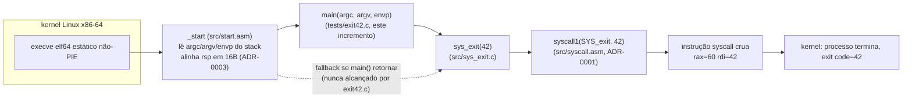

# Camada 0 -- primeiro incremento: pipeline build->link->run (`exit(42)` puro) -- Implementation Plan

> **For agentic workers:** REQUIRED SUB-SKILL: Use superpowers:subagent-driven-development (recommended) or superpowers:executing-plans to implement this plan task-by-task. Steps use checkbox (`- [ ]`) syntax for tracking.
>
> **Agente responsável:** `embedded-firmware-engineer` (domínio ASM x86-64 / ABI System V / freestanding). Execução SDD tarefa-a-tarefa, com review do líder por tarefa (nunca inline pelo orquestrador -- ver `AGENTS.md` seção "Governança").

**Goal:** A Camada 0 (`loucura_c_asm`) é, até hoje, **puramente decisão** -- 5 ADRs aceitos (`docs/adr/0001..0005`), zero linha de código. Este plano é o **despertar**: implementa as ondas **W1-W4** do `TODO.md` (itens `STD-SPDX`, `B1`, `B2`, `A6`, `B3`, `B4`, `B5`) até o **gate `B5`** -- um binário ELF64 estático, não-PIE, com `_start` próprio, **zero libc**, que faz `exit(42)`. Esse binário é a prova concreta e executável de que o pipeline `clang (freestanding) + nasm (Intel) + ld (nostdlib) -> ELF -> kernel Linux via syscall crua` funciona ponta a ponta, sem tocar em nenhuma função ou símbolo de libc. Tudo daqui pra frente (B6 `sys_write`, C1 harness de teste, D1 `memcpy` etc.) se apoia neste alicerce.

**Escopo explícito:** este plano cobre **só** até `B5` (o gate). `B6` (hello world / `sys_write`) e tudo além ficam **fora de escopo** -- é o próximo incremento, não antecipado aqui (YAGNI). O `Makefile` e os checkers construídos aqui, porém, são desenhados data-driven (wildcard sobre `src/*.c`/`src/*.asm`/`tests/*.c`) para absorver B6+ **sem precisar de edição** quando esse incremento chegar -- ver Task 4.

---

## Architecture

### Visão geral do pipeline



### Peças e decisão de cada uma

- **`include/types.h` (B1):** nosso `<stddef.h>`/`<stdint.h>` mínimo. `size_t`/`ssize_t`/`uintptr_t` como `(unsigned) long` (x86-64 Linux é LP64 -- `long` já tem 8 bytes, mesmo tamanho de ponteiro). `NULL` como `((void*)0)`. **`bool`/`true`/`false` NÃO são redefinidos** -- ver "Decisões de design" abaixo, é o achado mais não-óbvio deste incremento.
- **`include/syscall_nums.h` + `include/syscall_nums.inc` (B2):** só `SYS_exit = 60` nesta rodada (YAGNI -- não é a tabela completa de syscalls; cresce por onda). Duas versões (C e NASM) porque as duas linguagens não compartilham preprocessador -- duplicação mínima e intencional, documentada no próprio arquivo.
- **`tools/check_spdx.sh` (STD-SPDX):** grep do header SPDX no topo de todo arquivo de código da Camada 0. Vira, sem mudança nenhuma, a base do `TST-STATIC` (W11) mais adiante -- escrito uma vez, reusado.
- **`Makefile` (A6):** wildcard-based. `src/*.c` + `src/*.asm` = objetos de runtime (a "libc" que estamos construindo), linkados em **todo** binário de `tests/*.c`. Zero edição necessária quando B6+ adicionarem `src/sys_write.c` ou `tests/hello.c` -- o `Makefile` os descobre sozinho.
- **`src/syscall.asm` + `include/syscall.h` (B3):** os 7 wrappers genéricos `syscall0..6` (ADR-0001), cada um só reorganizando registradores da C-ABI (`rdi,rsi,rdx,rcx,r8,r9`[,stack]) pra ABI de `syscall` (`rax,rdi,rsi,rdx,r10,r8,r9`). Nenhuma lógica de negócio aqui -- é puro glue de convenção de chamada.
- **`src/start.asm` (B4):** `_start`. Lê `argc/argv/envp` da pilha inicial (layout do kernel Linux: `[rsp]`=argc, `[rsp+8]`=argv[0], depois envp), força alinhamento de 16B (ADR-0003, defensivo), chama `main`, e se `main` retornar, repassa o valor de retorno como exit code via `syscall1` -- rede de segurança que nunca deveria disparar num programa bem-comportado (que chama `sys_exit` explicitamente), mas evita que o processo caia no vácuo se `main` só fizer `return N;`.
- **`src/sys_exit.c` + `include/sys_exit.h` (parte da B5):** o primeiro wrapper C **nomeado** (ADR-0001 -- "helpers C nomeados e tipados são funções finas por cima" dos wrappers genéricos). `void sys_exit(int code)` nunca retorna.
- **`tests/exit42.c` (o gate da B5):** o binário mínimo. Chama `sys_exit(42)` explicitamente -- ver "Decisões de design" pra por que isso, e não um `return 42;` cru, é o desenho certo do teste.

### Decisões de design não cobertas explicitamente pelos ADRs (SINALIZADAS PARA REVISÃO DO LÍDER)

Os 5 ADRs fixam arquitetura (estilo de syscall, contrato de erro, ABI, alocador, layout ELF) mas não descem ao nível de "qual o nome da função C chamada por `_start`" ou "como o `Makefile` organiza objetos". Resolvi essas questões mecânicas para o plano avançar; nenhuma é one-way-door (todas são baratas de mudar depois), mas documento aqui porque envolvem julgamento não escrito em lugar nenhum:

1. **Nome e assinatura do entry C: `int main(int argc, char** argv, char** envp)`.** O nome `main` já está implícito no texto do ADR-0003 ("_start... antes de chamar main") e do item `B4` do `TODO.md` ("chamar main"), então não é uma decisão nova -- só a **assinatura de 3 argumentos** (incluindo `envp`, extensão comum GNU/musl, não-ISO-C estrita) é minha escolha, para casar com "ler argc/argv/envp do stack inicial" do próprio `B4`.
2. **`bool`/`true`/`false` do B1 NÃO são redefinidos.** Sob `-std=c23` (o piso deste projeto) eles são **palavras-chave da linguagem**, não mais macros de `<stdbool.h>` (mudança real do C23). Redefinir via `typedef`/`#define` colidiria com a palavra reservada e provavelmente nem compilaria. `types.h` documenta isso em vez de "implementar" -- é o achado técnico mais não-óbvio deste plano, revisar com atenção.
3. **`_start` chama `syscall1` diretamente (não duplica a lógica de shuffle de registradores em asm cru).** Já que `B3` é pré-requisito declarado de `B4` no `TODO.md`, reusar o wrapper genérico já existente é mais DRY que reimplementar o syscall de exit inline -- consistente com a filosofia do ADR-0001.
4. **`SYS_exit = 60` (a syscall `exit`, não `exit_group` = 231).** Como este runtime não tem threads (nem terá tão cedo), `exit` termina o único thread == termina o processo. Se/quando a Camada 0 ganhar threads, `exit_group` vira necessário para terminar o processo inteiro -- fora de escopo aqui, mas vale registrar a distinção para não escapar despercebida no futuro.
5. **Organização do `Makefile`: `src/*.{c,asm}` = runtime linkado em TODO binário; `tests/*.c` = um binário por arquivo (cada um define seu próprio `main`).** Não há ainda o harness `C1` (W6); o "teste" desta fase é literalmente rodar o binário e comparar `$?`. Resolvido com um manifesto plano `tests/expected_exit.txt` (nome-do-binário / exit-code-esperado) em vez de um arquivo por binário -- mais simples de ler/estender.
6. **`tests/exit42.c` chama `sys_exit(42)` explicitamente, em vez de só `return 42;`.** Isso exercita **dois** caminhos ao mesmo tempo e o teste distingue qual quebrou: se `sys_exit` estivesse quebrado (fosse no-op), `main` cairia no `return 0;` (dead code hoje, mas presente) e o **fallback** do `_start` (item 3 acima) então sairia com código **0** -- o teste falharia claramente (`42` esperado, `0` obtido), em vez de mascarar um `sys_exit` quebrado atrás de uma saída "correta por acidente".
7. **`section .note.GNU-stack noalloc noexec nowrite` em todo `.asm`.** Não é uma decisão de arquitetura, é uma prática defensiva padrão (evita a marca de stack executável / avisos de `ld` em algumas distros com defaults hardened) -- sinalizando porque não está em nenhum ADR e é fácil de esquecer.

### ADR

Nenhum ADR novo necessário -- este plano só **implementa** ADR-0001 (estilo de syscall), ADR-0002 (contrato de erro -- ainda não exercido nesta fase, `sys_exit` nunca falha/retorna), ADR-0003 (ABI interna) e ADR-0005 (layout ELF). Nenhuma bifurcação de opções concorrentes surgiu que justifique um ADR-0009.

**Tech Stack:** C23 (`clang -std=c23 -ffreestanding -nostdlib`), NASM sintaxe Intel (`-f elf64`), `ld -nostdlib -static -no-pie -e _start`. Toolchain confirmado (Fedora 44, `CLAUDE.md`): nasm 3.01, clang 22, GNU ld/objdump/readelf/nm 2.46. Alvo: Linux x86-64 (não bare-metal -- roda sobre o kernel via ABI de syscall).

---

## Global Constraints

(Cada task herda implicitamente esta seção.)

- **Zero libc, zero dependência externa.** Nenhuma chamada a função de libc, nenhum `#include` de header de sistema (`<stdio.h>`, `<stdlib.h>`, `<string.h>`, etc.). Se algo faltar, implementamos.
- **Identificadores em en-intl** (funções, variáveis, macros, labels NASM). **Comentários/docs bilíngues** no MESMO arquivo, **EN primeiro, depois PT**. Sem em-dash (usar `--` ou reformular).
- **SPDX header na PRIMEIRA linha de todo arquivo de código** (`.c`, `.h`, `.asm`, `.inc`, `Makefile`, `.sh`) -- comentário no estilo da linguagem (`//` C, `;` NASM, `#` Makefile/shell):
  ```
  SPDX-License-Identifier: MPL-2.0
  ```
  seguido do bloco `EN:`/`PT:` de propósito do arquivo, seguido de `Copyright (c) 2026 Petrus Silva Costa`. Padrão idêntico ao já usado no glintfx (`glintfx/include/glintfx/element_box.hpp` como referência de formatação). **NÃO** editar `CLAUDE.md`/`TODO.md` como parte deste plano (fora de escopo desta rodada de planejamento) -- o snippet abaixo é a fonte de verdade até o líder decidir espelhá-lo.
- **Assembly sempre sintaxe Intel** (NASM), consistente com `objdump -M intel`.
- **ABI System V AMD64 estrita** (ADR-0003): args inteiros/ponteiros em `rdi,rsi,rdx,rcx,r8,r9` (+ stack pro 7º); retorno em `rax`; callee-saved `rbx,rbp,rsp,r12-r15`; stack 16B-alinhada em toda fronteira de `call`.
- **Contrato de erro (ADR-0002):** funções que podem falhar devolvem `-errno` cru (não exercido nesta fase -- `sys_exit` nunca retorna, não tem "erro" a propagar).
- **Estrutura de pastas:** `src/` (.c e .asm da runtime), `include/` (.h e .inc), `tests/` (um `.c` por binário de prova, cada um com seu próprio `main`), `tools/` (scripts), `build/` (artefatos, gitignored -- já está no `.gitignore`).
- **Convenção nova (Task 5/6):** nomes-base não devem se repetir entre `src/` e `tests/` (o `Makefile` wildcard-based mapeia os dois pra `build/obj/<nome>.o` -- colisão de nome é um footgun conhecido, documentado, não mitigado automaticamente nesta fase por YAGNI).

---

## File Structure

```
include/
  types.h              [NOVO]  size_t/ssize_t/uintptr_t/NULL (B1)
  syscall_nums.h        [NOVO]  SYS_exit=60, versão C (B2)
  syscall_nums.inc      [NOVO]  SYS_exit=60, versão NASM (B2)
  syscall.h              [NOVO]  syscall0..6 (B3)
  sys_exit.h              [NOVO]  sys_exit(int) (B5)
src/
  syscall.asm             [NOVO]  syscall0..6 (B3)
  start.asm                [NOVO]  _start (B4)
  sys_exit.c                 [NOVO]  sys_exit (B5)
tests/
  exit42.c                    [NOVO]  binário-gate exit(42) (B5)
  expected_exit.txt            [NOVO]  manifesto nome->exit-code esperado (A6/B5)
tools/
  check_spdx.sh                 [NOVO]  checker de header SPDX (STD-SPDX)
Makefile                          [NOVO]  build/test/clean/run, wildcard-based (A6)
```

---

### Task 1: `STD-SPDX` -- snippet canônico + checker

**Files:**
- Create: `tools/check_spdx.sh`

**Interfaces:** nenhuma (script standalone).

- [ ] **Step 1: Escrever o checker**

`tools/check_spdx.sh`:
```sh
#!/usr/bin/env sh
# SPDX-License-Identifier: MPL-2.0
# EN: Verifies every code file (.c, .h, .asm, .inc, .sh, Makefile) under src/, include/,
#     tests/, tools/, and the top-level Makefile carries the SPDX header on one of its first
#     5 lines. Scoped to Layer 0 (loucura_c_asm) only -- does NOT walk glintfx/ (Layer 1 has
#     its own tooling and convention, already enforced). Exits non-zero and lists offenders if
#     any file is missing it. Reused later, unmodified, by TST-STATIC (TODO.md, W11).
# PT: Verifica se todo arquivo de código (.c, .h, .asm, .inc, .sh, Makefile) sob src/,
#     include/, tests/, tools/ e o Makefile de topo carrega o header SPDX numa das primeiras
#     5 linhas. Escopo restrito à Camada 0 (loucura_c_asm) -- NÃO varre glintfx/ (a Camada 1
#     tem tooling e convenção próprios, já aplicados). Sai com código não-zero e lista os
#     infratores se algum arquivo estiver sem. Reusado depois, sem mudança, pelo TST-STATIC
#     (TODO.md, W11).
# Copyright (c) 2026 Petrus Silva Costa
set -eu

missing=0
files=$(find src include tests tools -type f \
        \( -name '*.c' -o -name '*.h' -o -name '*.asm' -o -name '*.inc' -o -name '*.sh' \) \
        2>/dev/null)
[ -f Makefile ] && files="$files Makefile"

if [ -z "$files" ]; then
  echo "check_spdx: OK (0 files found)"
  exit 0
fi

for f in $files; do
  if ! head -n 5 "$f" | grep -q 'SPDX-License-Identifier: MPL-2.0'; then
    echo "MISSING SPDX: $f"
    missing=1
  fi
done

if [ "$missing" -eq 0 ]; then
  echo "check_spdx: OK"
else
  echo "check_spdx: FAILED"
fi
exit "$missing"
```

Run: `chmod +x tools/check_spdx.sh && ./tools/check_spdx.sh`
**Expected:** `check_spdx: OK` (o próprio script se auto-verifica -- 1 arquivo encontrado, com o header no topo, exit 0).

- [ ] **Step 2: Commit**
```bash
git add tools/check_spdx.sh && git commit -m "chore(loucura): checker de header SPDX -- base p/ TST-STATIC (STD-SPDX, W1)

STD-SPDX: 🔍 Pendente verificação"
```

---

### Task 2: `B1` -- `include/types.h`

**Files:**
- Create: `include/types.h`

**Interfaces:**
```c
typedef unsigned long size_t;
typedef long           ssize_t;
typedef unsigned long uintptr_t;
#define NULL ((void*)0)
```

- [ ] **Step 1: Escrever o header**

`include/types.h`:
```c
// SPDX-License-Identifier: MPL-2.0
// EN: Our own freestanding <stddef.h>/<stdint.h>-equivalent -- no libc header exists to pull
//     this from. `bool`/`true`/`false` are DELIBERATELY NOT defined here: under `-std=c23`
//     (this project's floor) they are language KEYWORDS -- C23 promoted them from
//     <stdbool.h> macros to reserved words. Redefining them (even via typedef) would collide
//     with the reserved keyword and very likely fail to compile. This is a real C23 behaviour
//     change, flagged explicitly in the implementation plan for review.
// PT: Nosso próprio equivalente freestanding a <stddef.h>/<stdint.h> -- não existe header de
//     libc de onde puxar isso. `bool`/`true`/`false` DELIBERADAMENTE NÃO são definidos aqui:
//     sob `-std=c23` (piso deste projeto) eles são PALAVRAS-CHAVE da linguagem -- o C23
//     promoveu de macros de <stdbool.h> pra palavra reservada. Redefini-los (mesmo via
//     typedef) colidiria com a palavra reservada e muito provavelmente falharia ao compilar.
//     É uma mudança de comportamento real do C23, sinalizada explicitamente no plano de
//     implementação para revisão.
// Copyright (c) 2026 Petrus Silva Costa
#pragma once

// EN: x86-64 Linux is LP64: `long`/`unsigned long` are 8 bytes, the same width as a pointer --
//     used directly as the backing type, no `__SIZE_TYPE__` compiler magic needed.
// PT: x86-64 Linux é LP64: `long`/`unsigned long` têm 8 bytes, a mesma largura de um
//     ponteiro -- usado diretamente como tipo de base, sem precisar de mágica de compilador
//     tipo `__SIZE_TYPE__`.
typedef unsigned long size_t;
typedef long           ssize_t;
typedef unsigned long uintptr_t;

#define NULL ((void*)0)
```

Run:
```sh
printf '#include "types.h"\nsize_t x = 0; ssize_t y = 0; uintptr_t z = 0; bool b = true; void* p = NULL;\n' \
  | clang -std=c23 -ffreestanding -nostdlib -fno-pic -fno-stack-protector -fno-builtin \
          -fno-asynchronous-unwind-tables -m64 -Wall -Wextra -Iinclude -fsyntax-only -xc -
```
**Expected:** sem saída, exit 0 (prova que `types.h` compila E que `bool`/`true`/`false` funcionam nativamente sob `-std=c23` sem serem definidos por nós).

Run: `./tools/check_spdx.sh`
**Expected:** `check_spdx: OK` (2 arquivos agora).

- [ ] **Step 2: Commit**
```bash
git add include/types.h && git commit -m "feat(loucura): types.h -- size_t/ssize_t/uintptr_t/NULL freestanding (B1, W1)

B1: 🔍 Pendente verificação"
```

---

### Task 3: `B2` -- constantes de syscall (`SYS_exit`)

**Files:**
- Create: `include/syscall_nums.h`, `include/syscall_nums.inc`

**Interfaces:**
```c
#define SYS_exit 60
```

- [ ] **Step 1: Escrever as duas versões (C e NASM)**

`include/syscall_nums.h`:
```c
// SPDX-License-Identifier: MPL-2.0
// EN: x86-64 Linux syscall numbers used by this increment. Grows incrementally with each
//     new wave (see TODO.md) -- intentionally NOT a full syscall table today (YAGNI): only
//     what B5's sys_exit needs. B6 (sys_write) appends SYS_write here, and so on. Mirrored in
//     syscall_nums.inc (NASM) -- kept in sync by hand; revisit generation only if this drifts
//     into a real maintenance burden (one constant today does not justify tooling).
// PT: Números de syscall x86-64 Linux usados por este incremento. Cresce incrementalmente a
//     cada nova onda (ver TODO.md) -- propositalmente NÃO é uma tabela completa de syscalls
//     hoje (YAGNI): só o que o sys_exit da B5 precisa. A B6 (sys_write) acrescenta SYS_write
//     aqui, e assim por diante. Espelhado em syscall_nums.inc (NASM) -- mantido em sincronia
//     manualmente; revisitar geração automática só se isso virar dor real de manutenção (uma
//     constante hoje não justifica tooling).
// Copyright (c) 2026 Petrus Silva Costa
#pragma once

#define SYS_exit 60
```

`include/syscall_nums.inc`:
```nasm
; SPDX-License-Identifier: MPL-2.0
; EN: NASM mirror of include/syscall_nums.h -- see that file for the full rationale.
; PT: Espelho NASM de include/syscall_nums.h -- ver aquele arquivo para o racional completo.
; Copyright (c) 2026 Petrus Silva Costa
%define SYS_exit 60
```

Run:
```sh
printf '#include "syscall_nums.h"\nlong n = SYS_exit;\n' \
  | clang -std=c23 -ffreestanding -nostdlib -fno-pic -fno-stack-protector -fno-builtin \
          -fno-asynchronous-unwind-tables -m64 -Wall -Wextra -Iinclude -fsyntax-only -xc -
```
**Expected:** sem saída, exit 0.

Run: `./tools/check_spdx.sh`
**Expected:** `check_spdx: OK` (4 arquivos).

- [ ] **Step 2: Commit**
```bash
git add include/syscall_nums.h include/syscall_nums.inc && git commit -m "feat(loucura): SYS_exit=60 (C + NASM) -- base minima p/ o gate B5 (B2, W1)

B2: 🔍 Pendente verificação"
```

---

### Task 4: `A6` -- sistema de build (`Makefile`)

**Files:**
- Create: `Makefile`

**Interfaces:** alvos `build`, `test`, `clean`, `run`.

- [ ] **Step 1: Escrever o `Makefile`**

`Makefile`:
```makefile
# SPDX-License-Identifier: MPL-2.0
# EN: Freestanding build system for the sovereign C+ASM runtime (Layer 0, "loucura_c_asm").
#     Zero libc: every flag below explicitly drops the toolchain's own runtime assumptions.
#     See CLAUDE.md "Como buildar (sem libc)" for why each flag exists. Wildcard-based:
#     src/*.c + src/*.asm are the shared runtime, linked into EVERY tests/*.c program (each
#     one its own `main`). Adding a new runtime primitive (src/) or a new gate program
#     (tests/) needs NO edit here -- picked up automatically.
# PT: Sistema de build freestanding do runtime soberano C+ASM (Camada 0, "loucura_c_asm").
#     Zero libc: toda flag abaixo derruba explicitamente as suposicoes de runtime do
#     toolchain. Ver CLAUDE.md "Como buildar (sem libc)" pra por que cada flag existe.
#     Wildcard-based: src/*.c + src/*.asm sao a runtime compartilhada, linkada em TODO
#     programa tests/*.c (cada um com seu proprio `main`). Adicionar uma primitiva nova
#     (src/) ou um programa-gate novo (tests/) NAO exige editar este arquivo -- e' pego
#     automaticamente.
# Copyright (c) 2026 Petrus Silva Costa

CC := clang
AS := nasm
LD := ld

CFLAGS  := -std=c23 -ffreestanding -nostdlib -fno-pic -fno-stack-protector \
           -fno-builtin -fno-asynchronous-unwind-tables -m64 -Wall -Wextra -Iinclude
ASFLAGS := -f elf64 -Iinclude/
LDFLAGS := -nostdlib -static -no-pie -e _start

BUILD := build
OBJ   := $(BUILD)/obj
BIN   := $(BUILD)/bin

# EN: Shared runtime objects -- linked into EVERY program below (the "libc" we are building).
# PT: Objetos de runtime compartilhados -- linkados em TODO programa abaixo (a "libc" que
#     estamos construindo).
RUNTIME_C_SRCS   := $(wildcard src/*.c)
RUNTIME_ASM_SRCS := $(wildcard src/*.asm)
RUNTIME_OBJS     := $(patsubst src/%.c,$(OBJ)/%.o,$(RUNTIME_C_SRCS)) \
                     $(patsubst src/%.asm,$(OBJ)/%.o,$(RUNTIME_ASM_SRCS))

# EN: Each tests/*.c file is its own tiny freestanding program (defines `main`), linked with
#     every runtime object above into build/bin/<name>. Known footgun (accepted, YAGNI):
#     a src/ file and a tests/ file sharing the same base name would collide under
#     build/obj/<name>.o -- do not duplicate base names across the two directories.
# PT: Cada tests/*.c e' um pequeno programa freestanding proprio (define `main`), linkado com
#     todo objeto de runtime acima em build/bin/<name>. Footgun conhecido (aceito, YAGNI):
#     um arquivo em src/ e outro em tests/ com o MESMO nome-base colidiriam em
#     build/obj/<name>.o -- nao duplicar nomes-base entre as duas pastas.
PROGRAM_SRCS := $(wildcard tests/*.c)
PROGRAMS     := $(patsubst tests/%.c,$(BIN)/%,$(PROGRAM_SRCS))

.PHONY: build test clean run

build: $(PROGRAMS)

$(OBJ)/%.o: src/%.c | $(OBJ)
	$(CC) $(CFLAGS) -c $< -o $@

$(OBJ)/%.o: src/%.asm | $(OBJ)
	$(AS) $(ASFLAGS) $< -o $@

$(OBJ)/%.o: tests/%.c | $(OBJ)
	$(CC) $(CFLAGS) -c $< -o $@

$(BIN)/%: $(OBJ)/%.o $(RUNTIME_OBJS) | $(BIN)
	$(LD) $(LDFLAGS) -o $@ $^

$(OBJ) $(BIN):
	mkdir -p $@

# EN: Runs every program and checks its exit code against the manifest tests/expected_exit.txt
#     (lines "<name> <expected-code>"; missing entry defaults to 0). Temporary harness for this
#     increment -- superseded by the C1 test runner (TODO.md, W6) once it exists.
# PT: Roda todo programa e checa o exit code contra o manifesto tests/expected_exit.txt
#     (linhas "<nome> <codigo-esperado>"; entrada ausente assume 0). Harness temporario deste
#     incremento -- substituido pelo runner de teste C1 (TODO.md, W6) quando existir.
test: build
	@status=0; \
	for prog in $(PROGRAMS); do \
		name=$$(basename $$prog); \
		expected=$$(awk -v n="$$name" '$$1==n{print $$2}' tests/expected_exit.txt 2>/dev/null); \
		[ -n "$$expected" ] || expected=0; \
		$$prog; actual=$$?; \
		if [ "$$actual" = "$$expected" ]; then \
			echo "PASS: $$name (exit=$$actual)"; \
		else \
			echo "FAIL: $$name (exit=$$actual, expected=$$expected)"; \
			status=1; \
		fi; \
	done; \
	exit $$status

run: build
	@for prog in $(PROGRAMS); do echo "--- $$prog ---"; $$prog; echo "exit=$$?"; done

clean:
	rm -rf $(BUILD)
```

Run: `make build && echo BUILD_OK && make clean && echo CLEAN_OK`
**Expected:** `BUILD_OK` seguido de `CLEAN_OK` (sem erro -- neste ponto `PROGRAMS`/`RUNTIME_OBJS` estão vazios, `make build` não tem nada a fazer e isso é sucesso válido; prova que a sintaxe do `Makefile` está correta antes de qualquer fonte existir).

Run: `make test`
**Expected:** exit 0, sem linhas `PASS`/`FAIL` (loop sobre lista vazia).

Run: `./tools/check_spdx.sh`
**Expected:** `check_spdx: OK` (5 arquivos).

- [ ] **Step 2: Commit**
```bash
git add Makefile && git commit -m "build(loucura): Makefile wildcard-based -- clang freestanding + nasm elf64 + ld nostdlib (A6, W1)

A6: 🔍 Pendente verificação"
```

---

### Task 5: `B3` -- camada de syscall (`syscall0..6`)

**Files:**
- Create: `src/syscall.asm`, `include/syscall.h`

**Interfaces:**
```c
long syscall0(long nr);
long syscall1(long nr, long a1);
long syscall2(long nr, long a1, long a2);
long syscall3(long nr, long a1, long a2, long a3);
long syscall4(long nr, long a1, long a2, long a3, long a4);
long syscall5(long nr, long a1, long a2, long a3, long a4, long a5);
long syscall6(long nr, long a1, long a2, long a3, long a4, long a5, long a6);
```

- [ ] **Step 1: `include/syscall.h`**

```c
// SPDX-License-Identifier: MPL-2.0
// EN: Generic arity-based raw syscall wrappers (ADR-0001). One NASM leaf function per arg
//     count (0..6), each moving the System V C-ABI argument registers into the raw `syscall`
//     instruction's own convention (rax=nr, rdi/rsi/rdx/r10/r8/r9=args) and returning the
//     kernel's raw value in rax -- callers apply ADR-0002's `-errno` contract themselves
//     (these wrappers never inspect or translate the return value).
// PT: Wrappers genericos de syscall crua por aridade (ADR-0001). Uma funcao NASM leaf por
//     numero de args (0..6), cada uma movendo os registradores de argumento da C-ABI System V
//     pra convencao propria da instrucao `syscall` (rax=nr, rdi/rsi/rdx/r10/r8/r9=args) e
//     retornando o valor cru do kernel em rax -- quem chama aplica o contrato `-errno` do
//     ADR-0002 por conta propria (estes wrappers nunca inspecionam nem traduzem o retorno).
// Copyright (c) 2026 Petrus Silva Costa
#pragma once

long syscall0(long nr);
long syscall1(long nr, long a1);
long syscall2(long nr, long a1, long a2);
long syscall3(long nr, long a1, long a2, long a3);
long syscall4(long nr, long a1, long a2, long a3, long a4);
long syscall5(long nr, long a1, long a2, long a3, long a4, long a5);
long syscall6(long nr, long a1, long a2, long a3, long a4, long a5, long a6);
```

- [ ] **Step 2: `src/syscall.asm`**

```nasm
; SPDX-License-Identifier: MPL-2.0
; EN: Implements syscall0..6 (ADR-0001). Each function receives its args per the System V
;     AMD64 C-ABI (1st..6th integer/pointer arg in rdi,rsi,rdx,rcx,r8,r9; a 7th spills to the
;     stack at [rsp+8]) and reshuffles them into the raw `syscall` instruction's own
;     convention (rax=number, args in rdi,rsi,rdx,r10,r8,r9 -- note r10 replaces rcx, which
;     the `syscall` instruction itself clobbers together with r11). Pure register glue, no
;     branches, no stack frame -- these are leaf functions.
; PT: Implementa syscall0..6 (ADR-0001). Cada funcao recebe seus args pela C-ABI System V
;     AMD64 (1o..6o arg inteiro/ponteiro em rdi,rsi,rdx,rcx,r8,r9; um 7o transborda pra pilha
;     em [rsp+8]) e os reorganiza pra convencao propria da instrucao `syscall` (rax=numero,
;     args em rdi,rsi,rdx,r10,r8,r9 -- nota: r10 substitui rcx, que a propria instrucao
;     `syscall` destroi junto com r11). Puro glue de registrador, sem desvio, sem frame de
;     pilha -- sao funcoes leaf.
; Copyright (c) 2026 Petrus Silva Costa

global syscall0
global syscall1
global syscall2
global syscall3
global syscall4
global syscall5
global syscall6

section .text
bits 64

syscall0:                  ; nr=rdi
    mov rax, rdi
    syscall
    ret

syscall1:                  ; nr=rdi a1=rsi
    mov rax, rdi
    mov rdi, rsi
    syscall
    ret

syscall2:                  ; nr=rdi a1=rsi a2=rdx
    mov rax, rdi
    mov rdi, rsi
    mov rsi, rdx
    syscall
    ret

syscall3:                  ; nr=rdi a1=rsi a2=rdx a3=rcx
    mov rax, rdi
    mov rdi, rsi
    mov rsi, rdx
    mov rdx, rcx
    syscall
    ret

syscall4:                  ; nr=rdi a1=rsi a2=rdx a3=rcx a4=r8
    mov rax, rdi
    mov rdi, rsi
    mov rsi, rdx
    mov rdx, rcx
    mov r10, r8             ; syscall wants a4 in r10, not r8
    syscall
    ret

syscall5:                  ; nr=rdi a1=rsi a2=rdx a3=rcx a4=r8 a5=r9
    mov rax, rdi
    mov rdi, rsi
    mov rsi, rdx
    mov rdx, rcx
    mov r10, r8              ; read old r8 (a4) BEFORE r8 is overwritten below
    mov r8,  r9
    syscall
    ret

syscall6:                  ; nr=rdi a1=rsi a2=rdx a3=rcx a4=r8 a5=r9 a6=[rsp+8]
    mov rax, rdi
    mov rdi, rsi
    mov rsi, rdx
    mov rdx, rcx
    mov r10, r8
    mov r8,  r9              ; read old r9 (a5) BEFORE r9 is overwritten below
    mov r9,  [rsp+8]          ; 7th C arg (a6), spilled to the stack by the caller
    syscall
    ret

section .note.GNU-stack noalloc noexec nowrite
```

Run:
```sh
mkdir -p build/obj
nasm -f elf64 -Iinclude/ src/syscall.asm -o build/obj/syscall.o
nm build/obj/syscall.o
```
**Expected:** 7 linhas, todas `T` (símbolo definido, seção `.text`, global): `syscall0` .. `syscall6`.

Run (inspeção visual, conferir o shuffle de registradores contra os comentários acima): `objdump -d -M intel build/obj/syscall.o`
**Expected:** cada função com as `mov` esperadas seguidas de `syscall` + `ret`; `syscall6` com um `mov r9,QWORD PTR [rsp+0x8]` antes do `syscall`.

Run:
```sh
printf '#include "syscall.h"\nlong r = syscall1(0,0);\n' \
  | clang -std=c23 -ffreestanding -nostdlib -fno-pic -fno-stack-protector -fno-builtin \
          -fno-asynchronous-unwind-tables -m64 -Wall -Wextra -Iinclude -fsyntax-only -xc -
```
**Expected:** sem saída, exit 0 (o header casa com a implementação).

Run: `./tools/check_spdx.sh`
**Expected:** `check_spdx: OK` (7 arquivos).

- [ ] **Step 3: Commit**
```bash
git add src/syscall.asm include/syscall.h && git commit -m "feat(loucura): syscall0..6 -- wrappers genericos por aridade (ADR-0001) (B3, W2)

B3: 🔍 Pendente verificação"
```

---

### Task 6: `B4` -- `_start` (entry point)

**Files:**
- Create: `src/start.asm`

**Interfaces:** símbolo global `_start` (entry ELF, `-e _start` no link). `extern main`, `extern syscall1`.

- [ ] **Step 1: Escrever `src/start.asm`**

```nasm
; SPDX-License-Identifier: MPL-2.0
; EN: Our own process entry point (ADR-0003, ADR-0005) -- there is no crt0/crt1 from any
;     libc. The kernel jumps here directly after execve(); NOTHING has run before this. Per
;     the System V AMD64 ABI (Linux specifics), at process entry:
;       [rsp]                = argc
;       [rsp+8]               = argv[0]  (an array of argc pointers, NULL-terminated)
;       [rsp+8+8*(argc+1)]    = envp[0]  (an array of pointers, NULL-terminated)
;     _start reads all three, aligns the stack to 16 bytes (ADR-0003 -- defensive: the ABI
;     already guarantees this at process entry, but we do not trust the loader
;     unconditionally), and calls `main(argc, argv, envp)`. If main ever returns, its return
;     value (in eax) is forwarded to the SYS_exit syscall via syscall1 (B3) -- this is the
;     ONLY termination path for a program that does not call sys_exit() itself; _start must
;     NEVER fall through past this point (`ret` here would jump into whatever garbage follows
;     in memory -- there is no caller to return to).
; PT: Nosso proprio ponto de entrada de processo (ADR-0003, ADR-0005) -- nao ha crt0/crt1 de
;     libc nenhuma. O kernel salta pra ca diretamente apos o execve(); NADA rodou antes disso.
;     Pela ABI System V AMD64 (especificidades Linux), na entrada do processo:
;       [rsp]                = argc
;       [rsp+8]               = argv[0]  (array de argc ponteiros, terminado em NULL)
;       [rsp+8+8*(argc+1)]    = envp[0]  (array de ponteiros, terminado em NULL)
;     O _start le os tres, alinha a pilha em 16 bytes (ADR-0003 -- defensivo: a ABI ja
;     garante isso na entrada do processo, mas nao confiamos incondicionalmente no loader), e
;     chama `main(argc, argv, envp)`. Se main algum dia retornar, seu valor de retorno (em
;     eax) e repassado a syscall SYS_exit via syscall1 (B3) -- esse e o UNICO caminho de
;     terminacao pra um programa que nao chama sys_exit() por conta propria; o _start NUNCA
;     pode cair alem deste ponto (`ret` aqui saltaria pro lixo que estiver depois na memoria
;     -- nao ha chamador pra quem retornar).
; Copyright (c) 2026 Petrus Silva Costa

%include "syscall_nums.inc"

extern main
extern syscall1
global _start

section .text
bits 64

_start:
    xor  rbp, rbp            ; EN: zero frame pointer -- conventional "end of stack" marker
                              ;     for debuggers/unwinders (glibc's crt1 does the same).
                              ; PT: zera o frame pointer -- marcador convencional de "fim da
                              ;     pilha" pra debuggers/unwinders (o crt1 da glibc faz igual).

    mov  rdi, [rsp]           ; argc
    lea  rsi, [rsp+8]         ; argv = &argv[0]
    lea  rdx, [rsi+rdi*8+8]    ; envp = argv + (argc+1)*8  (skip argv's own NULL terminator)

    and  rsp, -16              ; EN: force 16-byte alignment before `call main` (ADR-0003).
                              ; PT: forca alinhamento de 16 bytes antes de `call main`
                              ;     (ADR-0003).

    call main                  ; main(argc, argv, envp) -- rdi/rsi/rdx already set above

    ; EN: Fallback termination path -- reached only if main() actually returns (a program
    ;     that explicitly calls sys_exit()/_exit(), like the B5 exit42 gate program, never
    ;     gets here).
    ; PT: Caminho de terminacao de reserva -- alcancado so se main() de fato retornar (um
    ;     programa que chama sys_exit()/_exit() explicitamente, como o programa-gate exit42
    ;     da B5, nunca chega aqui).
    movsxd rsi, eax             ; a1 = (long)main's return value
    mov    rdi, SYS_exit         ; nr = 60
    call   syscall1

    ud2                          ; EN: unreachable -- SYS_exit never returns; trap loudly if
                              ;     it somehow did.
                              ; PT: inalcancavel -- SYS_exit nunca retorna; trapeia alto se,
                              ;     por algum motivo, retornasse.

section .note.GNU-stack noalloc noexec nowrite
```

Run:
```sh
mkdir -p build/obj
nasm -f elf64 -Iinclude/ src/start.asm -o build/obj/start.o
nm build/obj/start.o
```
**Expected:** `T _start` (definido), `U main` (indefinido -- externo), `U syscall1` (indefinido -- externo). **Não** linka ainda (não há `main` em lugar nenhum -- proposital, ver nota abaixo).

Run (inspeção manual): `objdump -d -M intel build/obj/start.o`
**Expected:** sequência `xor ebp,ebp` / `mov rdi,QWORD PTR [rsp]` / `lea rsi,[rsp+0x8]` / `lea rdx,[rsi+rdi*8+0x8]` / `and rsp,0xfffffffffffffff0` / `call` (relocação pendente pra `main`) / `movsxd rsi,eax` / `mov edi,0x3c` (`0x3c`=60=`SYS_exit`) / `call` (relocação pendente pra `syscall1`) / `ud2`.

> **Nota:** `_start` não tem, e não pode ter, um gate de execução isolado -- não existe `main` em lugar nenhum ainda até a Task 7. A prova em tempo de execução de que `_start` está correto acontece **transitivamente** na Task 7 (B5): rodar `build/bin/exit42` com sucesso (`exit=42`) só é possível se `_start` estiver montando `rdi/rsi/rdx` certo, alinhando a pilha certo, e chamando `main` certo. Isso é honesto com a própria tabela do `TODO.md`: só `B5` carrega o rótulo **GATE**, não `B4`.

Run: `./tools/check_spdx.sh`
**Expected:** `check_spdx: OK` (8 arquivos).

- [ ] **Step 2: Commit**
```bash
git add src/start.asm && git commit -m "feat(loucura): _start -- le argc/argv/envp, alinha stack 16B, chama main (B4, W3)

Verificacao completa em tempo de execucao adiada pra B5 (nao ha main ainda).
B4: 🔍 Pendente verificação"
```

---

### Task 7: `B5` -- `sys_exit` + binário mínimo `exit(42)` (**GATE**)

**Files:**
- Create: `include/sys_exit.h`, `src/sys_exit.c`, `tests/exit42.c`, `tests/expected_exit.txt`

**Interfaces:**
```c
void sys_exit(int code);   // never returns
```

- [ ] **Step 1: `include/sys_exit.h` + `src/sys_exit.c`**

`include/sys_exit.h`:
```c
// SPDX-License-Identifier: MPL-2.0
// EN: The first NAMED syscall wrapper (ADR-0001 -- "named, typed C helpers are thin
//     functions layered on top of syscall0..6"). Mirrors POSIX _exit(): terminates the
//     calling process/thread immediately, never returns. No error contract (ADR-0002)
//     applies -- there is no failure mode to propagate, the syscall does not return at all.
// PT: O primeiro wrapper de syscall NOMEADO (ADR-0001 -- "helpers C nomeados e tipados sao
//     funcoes finas por cima" das syscall0..6). Espelha o _exit() POSIX: encerra o
//     processo/thread chamador imediatamente, nunca retorna. Nenhum contrato de erro
//     (ADR-0002) se aplica -- nao ha modo de falha a propagar, a syscall simplesmente nao
//     retorna.
// Copyright (c) 2026 Petrus Silva Costa
#pragma once

void sys_exit(int code);
```

`src/sys_exit.c`:
```c
// SPDX-License-Identifier: MPL-2.0
// EN: sys_exit -- see include/sys_exit.h for the contract. Implemented as a 1-line wrapper
//     over syscall1(SYS_exit, code) (B3/ADR-0001): all the register-shuffling logic lives
//     once, in syscall.asm -- this file adds only the name and the constant.
// PT: sys_exit -- ver include/sys_exit.h pro contrato. Implementado como um wrapper de 1
//     linha sobre syscall1(SYS_exit, code) (B3/ADR-0001): toda a logica de reorganizacao de
//     registrador mora uma unica vez, em syscall.asm -- este arquivo so acrescenta o nome e
//     a constante.
// Copyright (c) 2026 Petrus Silva Costa
#include "sys_exit.h"
#include "syscall.h"
#include "syscall_nums.h"

void sys_exit(int code) {
    syscall1(SYS_exit, code);
    __builtin_unreachable(); // SYS_exit never returns to here.
}
```

- [ ] **Step 2: `tests/exit42.c` + `tests/expected_exit.txt`**

`tests/exit42.c`:
```c
// SPDX-License-Identifier: MPL-2.0
// EN: The B5 gate program. Proves the FULL pipeline end to end: clang(freestanding) +
//     nasm(elf64) + ld(nostdlib) -> ELF64 static no-PIE -> kernel exec -> _start (B4) ->
//     main() -> sys_exit(42) (B5) -> raw `exit` syscall -> process terminates with code 42.
//     Calls sys_exit(42) EXPLICITLY (not `return 42;`): this also indirectly exercises
//     _start's fallback exit path (B4) -- if sys_exit() were somehow broken/a no-op, main()
//     would fall through to `return 0;` below, and _start's fallback would then exit with
//     code 0 instead of 42, making the test fail LOUDLY on the wrong code rather than
//     silently "passing by accident".
// PT: O programa-gate da B5. Prova o pipeline INTEIRO ponta a ponta: clang(freestanding) +
//     nasm(elf64) + ld(nostdlib) -> ELF64 estatico nao-PIE -> exec do kernel -> _start (B4)
//     -> main() -> sys_exit(42) (B5) -> syscall `exit` crua -> processo termina com codigo
//     42. Chama sys_exit(42) EXPLICITAMENTE (nao `return 42;`): isso tambem exercita
//     indiretamente o caminho de fallback do _start (B4) -- se sys_exit() estivesse
//     quebrado/fosse no-op, main() cairia no `return 0;` abaixo, e o fallback do _start
//     sairia entao com codigo 0 em vez de 42, fazendo o teste falhar ALTO no codigo errado
//     em vez de "passar por acidente" silenciosamente.
// Copyright (c) 2026 Petrus Silva Costa
#include "sys_exit.h"

int main(int argc, char** argv, char** envp) {
    (void)argc;
    (void)argv;
    (void)envp;
    sys_exit(42);
    return 0; // unreachable -- sys_exit() above never returns
}
```

`tests/expected_exit.txt`:
```
exit42 42
```

- [ ] **Step 3: Build, rodar, e auditar as syscalls reais**

Run: `make build`
**Expected:** compila `src/syscall.asm`, `src/start.asm`, `src/sys_exit.c`, `tests/exit42.c`; linka `build/bin/exit42`. Sem erro, sem warning de `-Wall -Wextra`.

Run: `./build/bin/exit42; echo "exit=$?"`
**Expected:** `exit=42`.

Run: `make test`
**Expected:** `PASS: exit42 (exit=42)`, exit 0.

Run: `readelf -a build/bin/exit42 | grep -E 'Type:|Entry point|INTERP|Dynamic section'`
**Expected:** `Type: EXEC (Executable file)` (não `DYN` -- confirma no-PIE), um `Entry point address` diferente de zero (o endereço de `_start`), **nenhuma** linha `INTERP` nem `Dynamic section` (confirma estático, sem loader dinâmico -- ADR-0005).

Run: `objdump -d -M intel build/bin/exit42 | grep -A3 '<_start>:'`
**Expected:** o mesmo corpo de `_start` já inspecionado na Task 6, agora com os símbolos `main`/`syscall1` resolvidos (relocações preenchidas com endereços reais).

Run: `strace ./build/bin/exit42`
**Expected (a prova definitiva de zero libc):**
```
execve("./build/bin/exit42", ["./build/bin/exit42"], 0x... /* ... vars */) = 0
exit(42)                                = ?
+++ exited with 42 +++
```
Uma ÚNICA syscall própria (`exit`) além do `execve` que o próprio shell/kernel dispara para lançar o processo -- nenhum `brk`/`mmap`/`arch_prctl`/`access` de inicialização de libc (um binário glibc típico mostraria dezenas de linhas antes de chegar em `main`).

Run: `./tools/check_spdx.sh`
**Expected:** `check_spdx: OK` (12 arquivos).

- [ ] **Step 4: Commit final -- fecha o incremento**
```bash
git add include/sys_exit.h src/sys_exit.c tests/exit42.c tests/expected_exit.txt \
  && git commit -m "feat(loucura): sys_exit + binario exit(42) -- GATE do pipeline build->link->run (B5, W4)

Prova ponta a ponta (clang freestanding + nasm elf64 + ld nostdlib -> ELF64 estatico
no-PIE -> _start -> main -> sys_exit -> syscall exit crua) via 'make test' e
'strace ./build/bin/exit42' (uma unica syscall propria alem do execve).

B5: 🔍 Pendente verificação"
```

---

## Notas de execução

- **Ordem rígida:** as 7 tasks têm dependência linear estrita (`STD-SPDX` -> `B1`/`B2` -> `A6` -> `B3` -> `B4` -> `B5`) -- não paralelizar mesmo que o `TODO.md` marque `A6`/`B1`/`B2`/`STD-SPDX` na mesma onda `W1`; a ordem aqui existe pra que cada task tenha algo real pra compilar/linkar/verificar antes da próxima (ver "Decisões de design" item 5). Isso é resequenciamento mecânico de execução de um único implementador, não uma revisão das ondas do `TODO.md` (que continuam válidas como agrupamento de paralelizável-por-times).
- **`B4` não tem gate próprio de tempo de execução** -- isso é esperado e documentado na própria Task 6, não é uma lacuna. A prova real de `_start` acontece transitivamente quando `B5` roda.
- **O manifesto `tests/expected_exit.txt` e o alvo `make test` são deliberadamente simples e temporários.** Servem só até o `C1` (harness de teste próprio, `TODO.md` W6) existir -- não vale a pena construir um runner mais sofisticado agora pra um único binário (YAGNI).
- **Atualização do `TODO.md`:** fora do escopo desta rodada de planejamento (instrução explícita do líder). Cada commit acima já cita o ID certo (`STD-SPDX`, `B1`, `B2`, `A6`, `B3`, `B4`, `B5`) no corpo -- o hook `~/.claude/githooks/todo_sync.py` sincroniza o `Status` a partir disso; se não disparar automaticamente, o implementador toca a coluna `Status` de cada linha pra `🔍 Pendente verificação` manualmente no `TODO.md`, no mesmo lote de commits. `✅ Concluído` só depois da onda `TST-*`/`AUD-*` correspondente (fora de escopo aqui).
- **Próximo incremento (fora deste plano):** `B6` (`sys_write` + hello world 100% puro), depois `B7` (`sys_read`), depois `C1` (harness de teste próprio). O `Makefile` e `tools/check_spdx.sh` construídos aqui já estão prontos pra absorvê-los sem edição.
